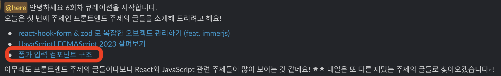
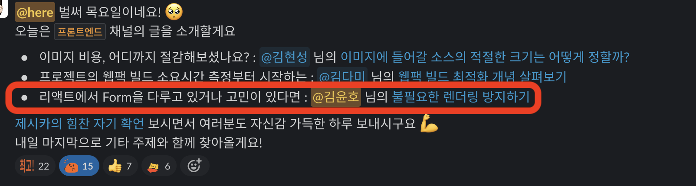

## 1. 글또란?

> "글 쓰는 또라이가 세상을 바꾼다”

[글또](https://www.notion.so/ac5b18a482fb4df497d4e8257ad4d516?pvs=21)는 `글 쓰는 개발자 모임`으로 글을 작성하는 개발 직군 분들이 모여서, 좋은 영향을 주고 서로 같이 성장할 수 있는 커뮤니티입니다. 올해 2월부터 7월까지, 6개월 동안 진행한 글또 8기 활동이 마무리되었습니다.

## 2. 왜 시작했어?

[글을 잘 쓰고 싶은 이유(Feat. 글또 8기 다짐)](<https://kimyouknow.github.io/essay/글을%20잘%20쓰고%20싶은%20이유(Feat.%20글또%208기%20다짐)>)에서 거창한 이유와 함께 글쓰기에 대한 제 생각을 정리했었는데, 사실 한 문장으로 요약할 수 있습니다.

> 내 의견을 논리적으로 전달하고 싶다!

직군을 불문하고 일을 잘하는 사람들은 글을 잘 씁니다. 유명한 사람들이 아니더라도 주위에 “이 사람 좀 하네?” 하는 사람들은 글을 잘 썼습니다. 언제나 실시간으로 대면해서 의사소통할 수 없기 때문에 글을 통해 의견을 전달하는 능력은 일을 잘하는 여러 조건 중 하나라고 생각합니다.

좋은 글에 대한 사람마다 기준이 다를 수 있습니다. 그래서 글또를 시작하기에 앞서 좋은 글에 대한 저만의 기준을 정했었습니다.

- 발표 대본과 같이 핵심과 기승전결이 드러나는 글
- 나만의 이야기(인사이트)가 있는 글

## 3. 그럼 뭐가 좋았어?

### 3-1. 좋은 글에 대한 고민

저는 일주일에 꼭 시간을 내서 글또 프론트 분들의 글들을 봤습니다. 기술적인 글, 학습 내용, 회고 등등 다양한 형태의 글이 있었습니다. 다양한 형식의 글을 보며 좋은 글에 대해 고민할 수 있었습니다.

시작할 때 정했던 좋은 글에 대한 기준을 고집할 필요가 없다고 느껴졌습니다. 글또 참여하신 분들이 작성해 주신 좋은 글들을 보며 `글의 목적과 독자에 맞게 유연하게 기준을 정해야 한다는 생각`이 들었습니다.

### 3-2. 큐레이션: 좋은 글을 쓸 수 있다!

> 큐레이션: 회차 간 글또 8기 내에서 생산된 글 중, 공유하고 싶은 글들을 에디터들이 뽑아 공유하는 채널

종종 “다른 사람이 내 글을 볼까?” 하는 생각도 들고, “내가 쓴 글이 좋은 글일까?” 하는 생각이 들 때가 있습니다. 감사하게도 큐레이션에 제가 작성한 Form과 관련된 고민을 담은 글 2개가 올라갔습니다!

[Form 다루기1: 폼과 입력 컴포넌트 구조](https://kimyouknow.github.io/fe/Form%20다루기1:%20폼과%20입력%20컴포넌트%20구조)

[Form 다루기2: 불필요한 렌더링 방지하기](https://kimyouknow.github.io/fe/Form%20다루기2:%20불필요한%20렌더링%20방지하기)

별거 아닌 것 같지만, 제 글이 다른 사람들에게 소개된 적이 처음이라 떨리기도 하고, 스스로 글에 대한 애정을 끌어 올릴 수 있었던 계기가 됐습니다.

### 3-3. 네트워킹

이건 여담인데, “글또 하시는 분”이라는 소리를 생각보다 많이 들었습니다. 저라는 사람이 어떤 관심을 가지고 있는지 표현할 수 있는 좋은 활동이었던 것 같습니다.

또한, 다양한 프론트엔드 개발자를 만나면서 앞으로 어떤 목표를 가져야 할지도 고민해 볼 수 있는 기회가 됐습니다. 글또에서 커피드백을 진행하며 새로운 사람을 만나고 다양한 고민을 들으면서 이전까지 막연하게 “프론트엔드 개발자 할거야!”에서 벗어나 어떤 개발자가 되고 싶은지 정리할 수 있었습니다.

## 4. 목표한 건 이뤘어?

패스를 한 번도 쓰지 않고 꾸준히 글 쓰는 게 목표였는데 아쉽게도 이루지 못했습니다. 왜 목표를 이루지 못했을까 생각해 봤는데,

### 4-1. 좋은 글에 대한 부담

남들이 봤을 때 우와~ 하는 글은 아니더라도 저만의 인사이트를 담고 싶었습니다. 좋은 글에 대한 저만의 기준을 고집하다 보니 글에 힘이 잔뜩 들어가고, 저도 쓰는데 버거움을 많이 느꼈던 것 같습니다. 가벼운 마음으로 읽기 좋은 글을 쓰고 싶었는데 쉽지 않았습니다.

### 4-2. 주제는 있지만 마무리하지 못한 글들

퇴고의 중요성을 느꼈습니다. 제출하지 못한 글 중에서는 주제는 있지만 마무리를 제대로 짓지 못한 글들이 있었습니다.

초고는 작성했는데 퇴고하지 않은 글들, 깊게 공부하지 않아 글을 쓰다 만 글들, 작성은 다 했는데 비슷한 주제의 좋은 글을 보고 제출을 하지 않은 글들,,

왜 마무리하지 못했나 생각해 봤을 때, 앞서 말했던 저만의 기준을 고집해서 스스로 부담을 느꼈기 때문이 아닐까 싶습니다.

### 4-3. 현재 진행 중인 프로젝트

현재 진행 중인 프로젝트는 글로 정리하기 어려웠습니다. 아직 충분히 학습하지 못한 기술이거나 글로 담을 만큼 완전히 이해하지 못한 부분이 많았습니다. 또한, 프로젝트 진행 중에 새롭게 파악한 부분들이 있어서 글로 작성하기에는 이르다고 느껴진 점도 있었습니다.

이러한 주제들은 프로젝트가 끝나는 시점에 리팩토링과 회고를 통해 글로 정리할 수 있지 않을까 기대하고 있습니다.

## 5. 마무리

글또 8기, 6개월 동안 좋은 글에 대해 고민할 수 있었고, 앞으로 어떤 글을 어떻게 써야지에 대한 고민을 할 수 있었습니다.

무엇보다 글또 활동 덕분에 앞으로 좋은 글쓰기 습관을 얻을 수 있었습니다! 글또 9기도 참여해서 이번 기수 때 아쉬웠던 부분을 보완해서 꾸준히 글을 써보고 싶네요.
