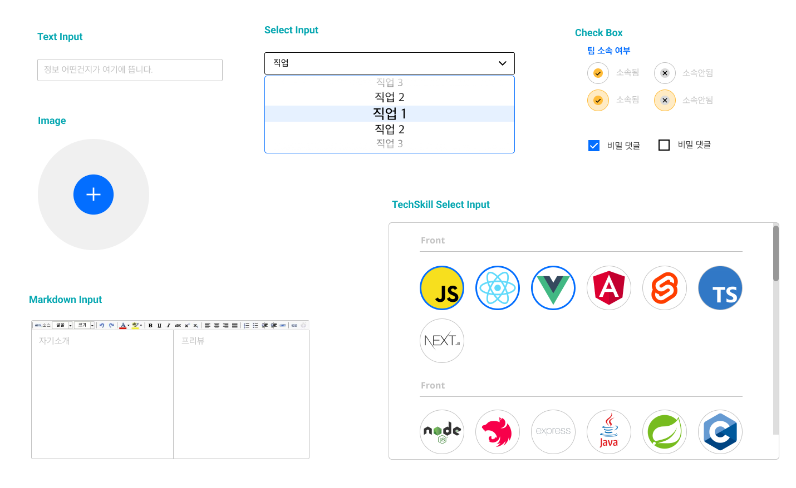

## 요약

다양한 Form과 Input을 다루면서 어떻게 하면 디자인 시스템을 활용하고 반복되는 로직을 줄일 수 있을까 고민해 봤습니다.

## 1. 폼이란?

웹에서 폼(Form)은 큰 비중을 차지합니다. 폼은 사용자의 입력 데이터를 처리하는 단순한 역할을 하지만 요구사항에 따라 로직은 얼마든지 복잡해질 수 있습니다. React에서 폼을 다루기 위해서 비제어 컴포넌트, 제어 컴포넌트 및 유용한 라이브러리(react-hook-form)를 사용할 수 있습니다.

이 글에서는 폼을 다루는 방식(로직)보다는 `폼과 입력 컴포넌트를 관리하는 구조`에 대한 고민을 정리해 봤습니다.

## 2. 사용자에게 입력받는 부분(Form)을 효과적으로 다루기

우선 프로젝트 사용하는 폼에 대해서 파악해보겠습니다.

**다양한 종류의 폼**

최근 프로젝트를 예시로 들어보겠습니다. 해당 프로젝트를 진행하며 다양한 종류의 폼(form)를 다뤘습니다.

> 로그인, 회원가입, 팀 모집 게시글 작성, 팀 모집 게시글 수정, 유저 프로필 수정, 유저 필수정보 입력, 댓글 및 대댓글 입력, 수정..


**다양한 종류의 입력**

각각의 폼들은 다양한 입력(Input) 컴포넌트로 구성됩니다.

> Text Input, Text Area, Image, Select-Option, Checkbox, 등등…



어떻게 하면 다양한 종류의 입력 컴포넌트와 폼을 일관성 있게 관리할 수 있을까요?

### 2.1 요구사항 분석

폼에서 제어해야 할 로직은 뭐가 있을까요? 여러 가지 복잡한 기능이 있을 수 있지만 `프로젝트에서 필요한 로직`은 아래와 같았습니다.

- 폼 내부의 입력 컴포넌트 상태 관리하기
  - 입력값 관리
  - 유효성 검사 및 에러 메시지
- 입력 컴포넌트들의 값을 모아서 제출(submit)하기
- 유효성 검사에 따른 버튼 비활성화

공통된 로직을 추출했지만, 폼마다 세부 사항은 다를 수 있습니다. 로그인 폼에서 필요한 입력값과 유저의 프로필을 수정하는 폼을 비교해 보겠습니다.

**로그인 폼**


로그인 폼에서는 이메일, 비밀번호가 필요하고 각각의 입력마다 `유효성을 검증`하는 로직이 필요합니다. 각각의 입력값에 대한 유효성 검사가 올바르다면 버튼을 활성화합니다.

**유저 프로필 수정 폼**


유저의 프로필을 수정하는 폼에서는 닉네임, 기술 스택, 희망 작업 기간, 팀 소속 여부 등등 `다양한 형식의 입력`이 필요합니다. 닉네임은 중복 여부를 확인해야 하며, 기술 스택, 희망 작업 기간 등등은 Text가 아닌 Select 형식의 입력 컴포넌트입니다. 닉네임에 대한 중복 여부 및 필수 입력사항이 입력되었다면 버튼을 활성화합니다.

### 2.2 공통 부분 정리

폼마다 `다루는 데이터는 다르지만 로직은 일관된다는 사실`을 알 수 있습니다. 그렇다면 `구체적인 동작은 모르더라도 어떻게 동작해야 하는지만 정의한다면 재사용할 수 있는 로직을 만들 수 있지 않을까` 생각했습니다.

- 로직: 폼마다 다루는 데이터는 다르지만, 로직은 일관됨으로 하나의 hooks를 만들어서 재사용하기
- UI: 여러 Input 컴포넌트를 조합해서 사용하기

## 3. 원하는 방향

위에서 정리한 사항을 토대로 다음과 같은 요구사항을 설정해 봤습니다.

- 다양한 폼에서 일관된 로직을 사용할 수 있게 만들기
- 다양한 종류의 입력 컴포넌트를 폼 단계에서 하나의 핸들러(onchange, onBlur)로 다루기
- 로직과 UI를 분리하기
  - UI는 상태와 핸들러를 전달받기만 하기
  - 로직은 custom hooks로 관리하기
  - Input 컴포넌트(UI)에 비즈니스 로직(유효성 검사)을 분리하기

### 3.1 다양한 Input 파악하기

> 재사용성, 추상화: 반복되는 코드를 줄이면서 재사용할 때는 쉽게 재사용할 수 있게 하기

다양한 종류의 Input 컴포넌트가 있지만 구성은 비슷합니다. 어떤 Input 컴포넌트이든지 사용자의 입력값, 에러 메시지, 라벨(label), place holder가 필요했습니다. 종류가 다르더라도 동일한 props를 전달받아 동작할 수 있는 컴포넌트로 만들었습니다.

**핵심동작(props)**

- id: 입력 컴포넌트 식별자
- value: 입력 컴포넌트 상태
- onChange: 입력 컴포넌트의 상태를 변경하는 함수
- helperText: 에러 메시지

**예시**

```tsx
<SelectInput
  id="job"
  label="직업"
  placeHolder="직업"
  options={jobOptions}
  value={inputValues.job}
  onChange={onChangeHandler}
/>
<TechStackSelectInput
  id="techSkills"
  placeholder="기술"
  label="기술"
  value={inputValues.techSkills}
  onChange={onChangeHandler}
  helperText={validateError.techSkills}
/>
<TextInput
  id="slogan"
  label="슬로건"
  placeholder="슬로건"
  value={inputValues.slogan}
  onChange={onChangeHandler}
  helperText={validateError.slogan}
/>
```

### 3.2 로직 분리하기

입력 컴포넌트마다 상태를 직접 관리할 필요 없이 폼 계층에서 통합에서 관리해야 한다고 생각했습니다. 각각의 입력 컴포넌트들이 서로 영향을 줄 수 있도 있고, 버튼을 비활성화하는 로직처럼 다른 곳에서 입력 컴포넌트의 상태를 활용하기 때문입니다.

따라서 로직을 React 컴포넌트가 아닌 hooks로 분리해야겠다는 생각이 들었습니다. 로직을 더 세분화하자면 로직은 상태관리(useForm), 유효성 검증(service폴더), 제출하기(submitCallback)으로 구분할 수 있습니다.

**상태관리**

폼 안에서 사용하는 입력 컴포넌트들의 입력값과 에러 메시지를 useState 객체로 관리했습니다. Input들의 상태를 객체로 관리하여 폼마다 원하는 Input들을 유연하게 관리할 수 있게 만들었습니다.

또한, TextInput, SelectInput 등 다양한 Input 컴포넌트들의 상태 변경을 `onChangeHandler`라는 하나의 함수로 관리했습니다.

```tsx
const useForm = <T extends Record<string, string>>({
  initialValues,
  // 생략
}: UseFormOptions<T>): UseFormReturns<T> => {
  const [inputValues, setInputValues] = useState<T>(initialValues)
  const [validateError, setValidateError] = useState<Record<keyof T, string>>({} as Record<keyof T, string>)

  const onChangeError = (id: keyof T, value: string) => {
    if (mode === FORM_MODE.onChange || mode === FORM_MODE.onBlur) {
      const res = validate({ ...inputValues, [id]: value })
      setValidateError({ ...validateError, [id]: res[id] })
    } else {
      setValidateError(validate({ ...inputValues, [id]: value }))
    }
  }

  const onBlurHandler = (id: keyof T, value: string)): void => {
    const { id, value } = event.target
    onChangeError(id, value)
  }

  const onChangeHandler = (id: keyof T, value: string): void => {
    if (mode === FORM_MODE.onBlur) {
      onBlurHandler(id, value)
      return
    }
    setInputValues({ ...inputValues, [id]: value })
    onChangeError(id, value)
  }
  // 생략
}
```

**유효성 검증과 에러 메시지**

유효성 검증 로직이 UI 분리되어야 한다고 생각했습니다. 프로젝트에서 사용하는 React컴포넌트는 다음과 같은 규칙을 가지고 있습니다.

```tsx
const Component = () => {
  // 상태관리 로직

  // 스타일과 관련된 코드
  // S.~ : Styled-component
  return <S.Box></S.Box>
}
```

유효성 검증이 필요한 입력 컴포넌트마다 로직을 props로 전달한다면 `스타일과 관련된 부분에 비즈니스와 관련된 로직이 섞여 있어 유지보수를 어렵게 할 수 있다는 생각이 들었습니다.`

```tsx
<TextInput
  validate={{ required: true, maxLength: 20, pattern: /^[A-Za-z]+$/i }}
  // ...생략
/>
<TextInput
  validate={{ required: true, minLength: 5 }}
  // ...생략
/>
```

각각의 Input 컴포넌트들은 서비스와 관련된 로직을 알 필요가 없습니다. `Input 컴포넌트들은 UI 컴포넌트라는 역할에 맞게 유효성 검증이라는 비즈니스 로직이 아닌 에러 메시지라는 상태만 알고 있으면 됩니다.`

```tsx
<TextInput
  id="slogan"
  helperText={validateError.slogan}
  // ...생략
/>
<SelectInput
  id="job"
  helperText={validateError.job}
  // ...생략
/>
```

유효성을 검증하는 로직은 함수로 만들어 `service`폴더에서 관리했습니다.

```tsx
// src/service/auth.validation.ts
export const loginValidate = ({ email, password }: LoginValidateProps): LoginValidateProps => {
  const validateErrors = {
    email: '',
    password: '',
  }
  if (!email) {
    validateErrors.email = '이메일이 입력되지 않았습니다. '
  } else if (!email.match(emailRegex)) {
    validateErrors.email = '이메일 형식으로 입력해주세요.'
  }

  if (!password) {
    validateErrors.password = '비빌번호가 입력되지 않았습니다. '
  } else if (password.length < 8 || password.length > 20) {
    validateErrors.password = '비빌번호는 8자 이상 20자 이하이어야 합니다. '
  }

  return validateErrors
}
```

**제출하기**

어떤 폼은 제출 이후 특정 페이지로 이동하게 할 수도 있고, 어떤 폼은 제출 전에 이미지를 이미지 서버에 올려야 하는 경우가 있었습니다. 이처럼 폼마다 제출 이후 로직이 다른 경우가 많아 제출함수를 외부에서 주입 받을 수 있게 만들었습니다.

```tsx
const useForm = <T extends Record<string, string>>({
  submitCallback,
}: // 생략
UseFormOptions<T>): UseFormReturns<T> => {
  // 생략
  const submitHandler = async (event: React.FormEvent<HTMLFormElement>): Promise<void> => {
    event && event.preventDefault()

    if (!satisfyAllValidates) {
      showEntireError()
      return
    }
    await submitCallback(inputValues)
    resetInputValues()
    resetValidateErrors()
  }
  // 생략
}
```

**적용하기**

앞서 고민한 상태관리(useForm), 유효성 검증(service폴더), 제출하기(submitCallback)의 기능들은 아래와 같이 적용할 수 있습니다.

```tsx
// Edit User Profile
import { editUserValidation } from '@/service/user.validation'

const submitCallback = async submitData => {
  // 데이터 파싱
  const changedProfileImageSubmitData = await uploadImageFileBeforeSubmit(submitData)
  const parsedSubmitData = newTeamPostParser(changedProfileImageSubmitData)
  // API 요청
  await requestCommand({
    newConfig: { data: parsedSubmitData },
    successMessage: API_MESSAGE.SUCCESS_NEW_TEAM,
  })
  // 생략
}

const { inputValues, validateError, onChangeHandler, submitHandler, satisfyAllValidates } = useForm({
  initialValues: {
    nickname,
    profileImage,
    techSkills,
    slogan,
    hopeSession,
    job,
    belongTeam,
    introduction,
    portfolio,
  },
  submitCallback,
  validate: editUserValidation,
})
```

## 4. 아쉬운 점

useForm은 활용도가 꽤 높았습니다. 앞서 정리한 요구사항 뿐만 아니라 이를 토대로 다양한 형태의 폼에 유연하게 적용할 수 있었습니다. 또한, 입력컴포넌트가 여러 페이지에서 분산된 다중 폼에서 사용해야 하는 경우 React의 Context API와 조합하여 구현할 수 있었습니다.

하지만 아쉬운 점도 있었습니다.

### 4.1 진짜로 유용한가?

DX 관점에서 만든 사람만 이해하는 코드일까 하는 의문이 들었습니다. 현재 useForm에서 사용되는 핵심 데이터는 3곳으로 분산됩니다.

- **useForm:** Input들의 입력 및 에러 상태를 관리합니다.
- **validate**: 폼에서 사용되는 Input들의 유효성을 검증합니다.
- **Submit**: Submit 이벤트 발생 시 동작해야 하는 흐름을 구성합니다.

물론, 현재 요구사항에 맞게 동작하는 코드이지만 프로젝트가 확장되거나 다른 사람이 수정해야 할 때도 유용한 구조인지 고민해 봤습니다.

폼에서 관리해야 하는 상태가 더 복잡해지고, 요구사항이 추가될 때 유연하게 다룰 수 있을까요? 혹은 팀 프로젝트에서 다른 사람이 쉽게 수정할 수 있을까요?

### 4.2 최적화

useForm에서 사용하는 onChangeHandler는 얕은 복사를 통해 useState의 객체를 변경합니다. 이로인해 하나의 Input 컴포넌트에 사용자가 입력값을 입력할 때마다 폼 전체가 다시 렌더링되는 상황이 발생합니다.


비제어 컴포넌트, useImperativeHandle, react-hook-form, Observer-pattern 등 다양한 해결 방법과 리렌더링이 사용자에게 끼칠 영향에 대한 고민은 2부에서 정리해 보겠습니다.

## 5. 마무리

프로젝트를 진행하며 다양한 폼과 입력 컴포넌트들을 다루기 위한 고민을 정리해 봤습니다.

2부인 다음 글에서는 구조가 아닌 useForm에 대해 집중적으로 다뤄보겠습니다.
