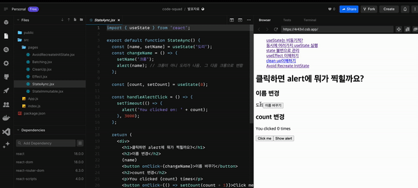
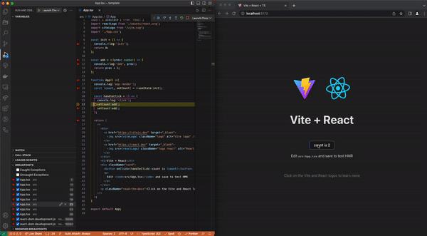
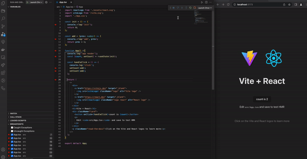

React 렌더링과 setState의 동작 방식에 대해서 다시 알아봤습니다. 공식 문서와 소스 코드를 보며 잘못 이해한 부분을 바로 잡기 위한 과정을 정리해 봤습니다.

해당 개념을 학습한 이유부터 시작해 해소 과정을 다루었기 때문에 글이 깁니다. 핵심만 파악하고 싶으신 분들은 [4번 - 공식문서에서 설명하는 Render와 Commit](#4-%EF%B8%8F공식-문서에서-설명하는-render와-commit%EF%B8%8F)과 [6번 - useState는 왜 이렇게 동작해?](#6-%EF%B8%8Fusestate는-왜-이렇게-동작해%EF%B8%8F)만 보시면 됩니다!

## 0. 요약

React 컴포넌트가 화면에 표시되는 과정에서 Render phase와 Commit phase를 구분해서 생각해야 합니다. `Render phase`는 React가 컴포넌트를 호출하여 react element를 반환하는 과정에서 가상돔 재조정 작업이 진행되는 단계입니다. `Commit phase`는 재조정한 가상 돔을 실제 돔에 적용하는 단계입니다.

setState 호출이 즉시 상태를 변경하는 것이 아니라, React는 내부적으로 상태 변경을 일괄 처리하고 최적의 성능을 위해 업데이트를 지연시킵니다.

`setState를 호출한다는 것은 state를 바로 업데이트하지 않고 update 함수를 큐(대기열)에 넣는 행위`입니다. React는 모든 update 함수를 큐에 저장한 다음 render phase에서 평가합니다. 그렇기 때문에 React는 기본적으로 re-render를 예약합니다. React는 render phase의 재조정(Reconciliation)과정에서 대기 중인 update 함수들을 적용한다고 할 수 있습니다.

## 1. 왜 공부하기 시작했는지

React 과제 테스트를 연습하는 과정에서 useState를 활용한 컴포넌트 렌더링 과정에서 제가 예상한 동작과 다르게 동작하는 부분을 발견했습니다. 이전에는 React 컴포넌트를 “jsx를 반환하는 함수”라고 생각하고 사용했습니다. “모든 렌더링은 고유의 prop, state, 이벤트 핸들러를 가진다.”, “snapshot” 등의 개념을 알고 있었고 애초에 useState함수를 복잡한 로직으로 사용하지 않있기 때문에 문제가 발생한 적은 없었습니다.

하지만 예상과 다르게 동작하는 디버거를 보며 제가 컴포넌트와 렌더링에 대해서 잘못 이해하고 있는 부분이 있구나 싶었습니다. 추상적으로 이해하고 사용했던 것 같아 공식 문서를 보면서 다시 학습해 봤습니다.

```jsx
const init = () => {
  console.log('init')
  return 0
}

const add = (prev: number) => {
  console.log('add', prev)
  return prev + 1
}

function App() {
  console.log('app render')
  const [count, setCount] = useState(init)

  const handleClick = () => {
    console.log('click')
    setCount(add)
    setCount(add)
  }

  return <button onClick={handleClick}>count is {count}</button>
}

export default App
```

**예상 동작**

```markdown
mount: app render → init → return
click: click → add 0 → add 1 → app render → return
```

**실제 동작**

```markdown
mount: app render → init → return
1st click: click → add 0 → app render → add 1 → return
2nd click after : click → app render → add 2 → add 3 → return
```

## 2. 어떤 부분을 잘못 알고 있었을까?

잘못 이해한 부분을 찾기 위해 "**React는 언제 또는 왜 컴포넌트를 렌더링하는지**"에 대해 다시 찾아볼 필요가 있었습니다.

React가 컴포넌트를 렌더링하는 경우는 두 가지로 나누어 생각할 수 있습니다.

1. React 컴포넌트에 예정된 상태 업데이트가 있을 경우
2. 부모 컴포넌트가 렌더링 되고 해당 컴포넌트가 리렌더링에서 제외되는 기준에 충족하지 않을 경우

cf> 리렌더링 제외 조건 4가지

- 컴포넌트가 이전에 렌더링 되었어야 한다. 즉, 이미 마운트 되었어야 한다.
- 변경된 props(참조)가 없어야 한다.
- 컴포넌트에서 사용하고 있는 context 값이 변경되지 않아야 한다.
- 컴포넌트에 예정된 상태 업데이트가 없어야 한다.

여기서 제가 오해한 부분은 “1번. React 컴포넌트에 예정된 상태 업데이트가 있을 경우”입니다. 저는 상태가 변경되면 컴포넌트가 이를 감지하고, 함수형 컴포넌트가 다시 호출되는 흐름으로 이해했었습니다. 이전에 바닐라 컴포넌트를 구현했을 때도 비슷하게 이해하고 아래처럼 구현했습니다.

```jsx
// 대충 새로운 상태를 받을 때마다 해당 컴포넌트를 다시 render 하는 흐름을 가진 바닐라 컴포넌트
class Component {
  //...생략
  setState(newState) {
    this.state = { ...this.state, ...newState }
    this.render()
  }

  render() {
    this.innerHTML = this.template()
  }
}
```

하지만 React에서 setState는 다르게 동작합니다. setState의 동작원리를 정리하기 전에 React의 핵심 개념과 렌더링에 대해서 알아보겠습니다.

## 3. 용어정리

React 컴포넌트의 라이프 사이클을 공부하기 전 컴포넌트, 엘리먼트, 렌더링 등 어렴풋이 알고 있는 용어를 명확히 할 필요가 있었습니다.

### React element

React element는 일반적으로 JSX (JavaScript XML) 문법을 사용하여 작성됩니다. React element는 DOM Tree 생성에 필요한 정보를 담은 `Javascript 객체`입니다. JSX 문법은 `React.createElement()` 을 호출하기 위한 하나의 방법일 뿐이고 Babel을 통해 파싱 되고 트랜스 파일링됩니다.

```ts
;<h1> Hello World </h1>

React.createElement('h1', null, 'Hello world')
```

즉 React element는 실제 DOM 노드가 아닙니다. createElement가 생성한 것은 DOM(or View or Node)이 아니라 React Element라는 자바스크립트 객체입니다.

React Element는 React DOM node element와 React Component element 두 종류로 구성됩니다.

- **DOM element** : 타입이 string일 때
- **Component element** : 타입이 class이거나 function일 때,

React는 type 값이 class이거나 function인 element(React component element)을 만나면 (1) type 값을 보고, 해당 component 함수에 element를 return 받고, return 받은 element의 type 값이 tag name인 element(DOM element)을 만날 때까지 1번으로 돌아갑니다.

### Component

Component는 props를 전달받아 React element를 반환하는 function입니다.

```jsx
import React from 'react'

function App() {
  return <h1>Hello World</h1>
}

import React from 'react'

function App() {
  return React.createElement('h1', null, 'Hello world')
}
```

### 가상돔(**Virtual DOM)**

React는 가상 돔이라는 실제 돔과 다른 돔 이미지를 유지하고 있습니다. 가상돔은 fiber architecture와 밀접한 관련이 있습니다.

가상돔이란 [가상적인 UI(an ideal, or “virtual”, representation of a UI)를 메모리에 유지하며 실제 돔과 동기화하는 프로그래밍 컨셉](https://legacy.reactjs.org/docs/faq-internals.html)입니다. 그리고 이 과정을 재조정이라고 합니다.

### 재조정(Reconciliation)

재조정이란 React에서 어떤 부분들이 변해야하는지 서로 다른 두 개의 트리를 비교하는 데 사용하는 알고리즘입니다. 렌더링 함수를 호출할 때 가상돔을 생성하고 이전 가상돔(snapshot)과 비교하여 변경된 부분만 실제 돔에 반영하는데, 이때 비교하는 과정을 재조정(Reconciliation)라고 합니다.

### render phase

가상돔을 재조정(**Reconciliation**)하는 단계입니다. 구체적인 내용은 아래에서 자세히 설명하겠습니다. 우선 commit phase와 render phase가 구분된다는 사실을 인지만 해도 됩니다!

### commit phase

재조정한 가상 돔을 실제 돔에 적용하는 단계입니다.

## 4. ⭐️공식 문서에서 설명하는 Render와 Commit⭐️

열심히 용어를 정리했다면 이제 컴포넌트가 화면에 표시되기까지의 과정을 자세히 살펴볼 차례입니다.

해당 과정에서 Render와 commit을 구분해서 생각해야 합니다. React가 UI를 요청하고 제공하는 프로세스는 4단계로 설명할 수 있는데요,

1. **Triggering** a render
2. **Rendering** the component
3. **Committing** to the DOM
4. Browser **paint**

### Step 1: Trigger a render

컴포넌트가 render 되기 위한 두 가지 상황이 있습니다.

1. createRoot로 인한 최초의 컴포넌트 렌더링
2. 컴포넌트의 상태를 [set 함수](https://react.dev/reference/react/useState#setstate)를 활용하여 업데이트할 때

### Step 2: React renders your components

> **“Rendering” is React calling your components.**

일반적으로 컴포넌트 렌더링이라 하면 컴포넌트 호출을 떠올립니다. 결론부터 말하자면, `Render는 가상돔 트리를 순회화면서 변경된 부분을 찾고, 필요한 작업을 fiber node에 저장하는 단계입니다.`

렌더링 과정을 쪼개서 살펴보면 아래와 같은 단계로 나눌 수 있습니다.

- React가 컴포넌트를 호출하여 react element를 반환한다.
- 가상돔 재조정 작업이 진행된다.
- renderer가 컴포넌트의 정보를 실제 돔에 삽입한다. (mount)
- 브라우저가 돔을 paint한다.

핵심은 `컴포넌트 호출과 DOM 삽입은 별개라는 점입니다.` 그리고 React에서는 DOM 삽입과 화면에 그려지는 것 또한 별개로 다루고 있습니다.

위의 4단계에서 렌더링은 `컴포넌트가 호출되어 react element를 반환하고 가상돔에 적용하는 일련의 과정`까지입니다. 그 이후 과정은 commit 단계라고 할 수 있습니다.

### Step 3: React commits changes to the DOM

> **React only changes the DOM nodes if there’s a difference between renders**

React는 Commit phase에서는 재조정이 끝난 가상돔을 실제 돔에 적용합니다.

앞서 렌더링 단계에서 컴포넌트를 호출하여 변경사항을 파악 뒤, React는 실제 돔을 조작합니다. 초기 렌더링의 경우 React는 appendChild() DOM API를 사용하여 생성한 모든 DOM 노드를 화면에 표시합니다. 리렌더링의 경우 React는 DOM이 최신 렌더링 출력과 일치하도록 최소한의 필수 작업(렌더링 중에 계산된다고 하네요.)을 적용합니다. (React는 렌더링 간에 차이가 있는 경우에만 DOM 노드를 변경합니다.)

즉, Commit phase에서 React는 재조정한 가상돔을 실제 돔에 적용하고 라이프 사이클을 실행시킵니다. 가상돔을 실제 돔에 적용할 때, 일관성을 위해 동기적으로 실행합니다. React가 돔을 조작한 뒤 콜스택을 비워줘야 브라우저가 paint할 수 있습니다.

### Epilogue: Browser paint

렌더링이 완료되고 React가 DOM을 업데이트한 후 브라우저는 화면을 다시 paint합니다. 해당 과정을 흔히 "브라우저 렌더링"이라고 [React 공식 문서](https://react.dev/learn/render-and-commit#epilogue-browser-paint)에서는 용어의 혼동을 피하고자 paint라고 정의했습니다.

## 5. Snapshot!

> **각 render의 상태(state)는 고정되어 있다. 모든 렌더링은 고유의 Prop과 state, 이벤트 핸들러를 가진다.**

"렌더링"은 React가 컴포넌트를 호출한다는 것을 의미합니다. 컴포넌트의 상태(state)는 컴포넌트의 메모리처럼 생각하면 됩니다. 함수가 반환된 후 사라지는 일반 변수와 달리 컴포넌트의 상태는 React 내부에서 유지되고 있습니다(”live”한 상태).

React는 구성 요소를 호출할 때 해당 특정 렌더링에 대한 상태의 snapshot을 제공합니다. 컴포넌트들은 렌더링마다 참조해야 할 상태를 가지고 있다고 할 수 있습니다.

아래 예시에서 버튼을 클릭한다면 alert 메시지에 어떤 값이 찍힐까요?

```jsx
import { useState } from 'react'

export default function App() {
  const [name, setName] = useState('도리')

  const handleClickChangeName = () => {
    setName('크롱')
    alert(name)
  }

  return (
    <div>
      <h1>클릭하면 alert에 뭐가 찍힐까요?</h1>
      <h2>이름 변경</h2>
      {name}
      <button onClick={handleClickChangeName}>이름 바꾸기</button>
    </div>
  )
}
```

결과는 다음과 같습니다.



React는 state를 업데이트하기 전에 이벤트 핸들러의 모든 코드가 실행될 때까지 기다립니다. 뒤에 set 함수를 설명하면서 자세히 다루겠지만, handleClickChangeName이 호출되는 시점에 참조하는 name은 “도리”이기 때문에 alert의 메시지로 “도리”가 찍힙니다. 이벤트 핸들러의 모든 코드가 실행되고 name을 “크롱”으로 업데이트합니다. 이후 React에서 변경된 상태를 확인하고 화면을 업데이트하는 과정을 거칩니다.

## 6. ⭐️useState는 왜 이렇게 동작해?⭐️

드디어 useState를 알아볼 차례입니다. useState는 state와 setState를 반환하는 hooks입니다.

글 처음에 제시한 코드가 기억나시나요? 여러 번의 set 함수와 컴포넌트는 왜 저렇게 동작하는 것일까요?

## Batches: [Queueing a Series of State Updates](https://react.dev/learn/queueing-a-series-of-state-updates)

아래와 같이 여러 개의 setState를 동시에 실행할 때 React 내부 동작은 어떻게 이뤄지는지 알아보겠습니다. 앞서 설명했듯이 React는 상태 업데이트를 처리하기 전에 이벤트 핸들러의 모든 코드가 실행될 때까지 기다립니다.

이때, set 함수를 바로 실행시키지 않고 set 함수의 인자로 넘겨준 함수들을 큐에 넣습니다! `set 함수를 호출하는 것은 state를 바로 업데이트하지 않고 update 함수를 큐(대기열)에 넣는 행위`라고 이해할 수 있습니다. set 함수가 컴포넌트의 렌더링을 유도(trigger)하고 나면 React는 render phase에서 가상돔을 재조정합니다. 이 때, 큐에 있는 update 함수들을 실행하며 새로운 상태 값을 계산합니다.

`React는 모든 update 함수를 큐에 저장한 다음 render phase에서 평가합니다. 그렇기 때문에 React는 기본적으로 re-render를 예약합니다. React는 render phase를 실행하고 해당 컴포넌트에 대해서 대기 중인 update 함수들을 적용한다고 할 수 있습니다.`

> **React waits until _all_ code in the event handlers has run before processing your state updates.**

> **_React queues this function to be processed after all the other code in the event handler has run._** During the next render, React goes through the queue and gives you the final updated state.

```jsx
<button
  onClick={() => {
    setNumber(n => n + 1) // (n) => n + 1이라는 함수를 큐에 등록
    setNumber(n => n + 1) // (n) => n + 1이라는 함수를 큐에 등록
    setNumber(n => n + 1) // (n) => n + 1이라는 함수를 큐에 등록
  }}
>
  +3
</button>
```

이벤트 핸들러가 완료되면 React는 다시 렌더링을 트리거 합니다. 다시 렌더링하는 동안 React는 큐를 처리합니다. Updater 함수는 렌더링 중에 실행되므로 Updater 함수는 순수해야 하며 결과만 반환해야 합니다.

아래 GIF를 보면 setState가 실행될 때 큐에 등록되고 컴포넌트 호출 이후 큐가 빌 때까지 updater 함수를 실행하는 과정을 통해 memoizedState(새로 계산된 state)을 반환하는 걸 알 수 있습니다.



정리하자면, 실제 컴포넌트는 변경된 예정된 update 함수가 큐에 있을 때, render phase에서 재조정 작업이 일어납니다. 그렇기 때문에 앞선 예제에서 컴포넌트의 호출이 먼저 일어나고 useState를 읽는 과정에서 update 함수가 실행된다고 할 수 있습니다.

```bash
2nd click after : click → app render → add 2 → add 3 → return
```



### 효율성 보장

setState 호출이 즉시 상태를 변경하는 것이 아니라, React는 내부적으로 상태 변경을 일괄 처리하고 최적의 성능을 위해 업데이트를 지연시킵니다. 이러한 지연은 React의 비동기적인 업데이트 처리 메커니즘인 "batching" 때문입니다. React는 한 번의 렌더링 주기 내에서 `여러 setState 호출을 한 번에 처리하여 불필요한 렌더링을 줄이고 성능을 최적화`합니다. 여러 개의 setState 호출이 있으면, 각 setState 호출은 별도의 업데이트로 큐에 추가됩니다. React는 이러한 여러 업데이트를 하나의 업데이트로 결합합니다. 이렇게 함으로써 중복된 렌더링이나 성능 저하를 방지할 수 있습니다.

또한, `setState 호출은 React에게 상태 변경을 알리는 것이지, 즉시 상태를 업데이트하지는 않습니다`. React는 내부적인 변경 감지 알고리즘을 사용하여 상태 변경을 감지합니다. 상태가 변경됐다면 React는 변경된 부분만 업데이트하고 필요한 경우에만 실제 돔에 반영합니다. 이를 통해 React는 불필요한 렌더링 작업을 최소화하고 효율적인 UI 업데이트를 수행합니다.

### 그러면 왜 첫 setState는 render 전에 실행되고 이후 setState는 큐에 등록돼?

정확한 해답은 아니지만 소스 코드의 주석을 참고했을 때 "내부 동작이 이렇구나" 정도로 이해하면 될 것 같습니다.

아래 코드는 setState를 실행했을 때 실행되는 dispatchSetState함수의 일부분입니다. 최초 렌더링(mount) 이후 큐는 비어있기 때문에 전체 render phase 전에 다음 상태를 열심히(eagerly) 계산한다고 합니다. ([소스 코드](https://github.com/facebook/react/blob/v18.0.0/packages/react-reconciler/src/ReactFiberHooks.new.js#L2234-L2259))

```jsx
if (fiber.lanes === NoLanes && (alternate === null || alternate.lanes === NoLanes)) {
  // The queue is currently empty, which means we can eagerly compute the
  // next state before entering the render phase. If the new state is the
  // same as the current state, we may be able to bail out entirely.
  ...
```

아래 GIF를 보면 첫 setState는 해당 if 문에서 걸리는 데 반해, 이후 setState는 컴포넌트 호출 이후 큐에서 계산되는 걸 확인할 수 있습니다.


## 마무리

update 함수가 실행되고 난 뒤, 변경 사항이 있을 때 컴포넌트가 다시 호출되는 것이 아닙니다! 효율적인 렌더링을 위해 set함수로 update함수를 큐에 등록할 때, render phase가 실행되며 해당 과정에서 재조정 작업을 통해 상태를 업데이트 합니다. render phase와 commit phase를 분리하여 가상돔의 변경 사항이 있을 때만 실제 돔에 반영하는 것을 알 수 있었습니다.

해당 글에서는 다루지 않았지만 React의 내부 동작을 완벽히 이해하기 위해서는 fiber architecture, reconciler, scheduler와 같은 개념을 알고 있어야 합니다. 학습 과정에서 찾아봤지만 제가 정리하고 공유할 수준은 안 된다고 생각해 좋은 참고 자료만 남깁니다!

- React18 톺아보기 시리즈(글): [https://goidle.github.io](https://goidle.github.io/)
- React 까보기 시리즈(유튜브): https://www.youtube.com/watch?v=JadWu4Ygnyc&list=PLpq56DBY9U2B6gAZIbiIami_cLBhpHYCA

긴 글 봐주셔서 감사합니다. 처음에는 간단하게 useState의 동작 원리에 대해서만 정리할까 고민을 했었습니다😅. 하지만 `React의 렌더링과 setState의 동작 원리에 대한 이해가 React 개발에 있어서 핵심적인 부분`이라고 생각해 핵심 용어 정리부터 시작해 렌더링 흐름 setState의 동작 원리까지 제가 이해한 부분을 정리해 봤습니다.

이전까지 어렴풋이 알고 있었던 “가상돔을 활용한 효율적인 업데이트”, "비동기적으로 동작하는 setState”, “배치(batching)” 등의 개념에 대해서 깊게 고민해 볼 수 있는 경험이었습니다. 또한, 바닐라 컴포넌트를 만들 때부터 느꼈던 `컴포넌트의 변화를 감지하고 UI를 업데이트하는 핵심 메커니즘`의 중요성을 다시 한번 느낄 수 있었습니다.

## 참고 자료

- https://react.dev/learn/render-and-commit
- https://react.dev/learn/state-as-a-snapshot
- https://react.dev/learn/queueing-a-series-of-state-updates
- https://velog.io/@eunbinn/when-does-react-render-your-component
- https://github.com/acdlite/react-fiber-architecture
- https://legacy.reactjs.org/docs/faq-internals.html
- https://github.com/facebook/react/issues/11527#issuecomment-360199710
- https://github.com/facebook/react/issues/20817#issuecomment-1293655302
- https://immigration9.github.io/react/2021/05/29/react-fiber-architecture.html
- https://bumkeyy.gitbook.io/bumkeyy-code/frontend/a-deep-dive-into-react-fiber-internals
- https://www.youtube.com/watch?v=JadWu4Ygnyc&list=PLpq56DBY9U2B6gAZIbiIami_cLBhpHYCA
- [https://goidle.github.io](https://goidle.github.io/)
- [https://hkc7180.medium.com/react-components-elements-and-instances-번역글-b5744930846b](https://hkc7180.medium.com/react-components-elements-and-instances-%EB%B2%88%EC%97%AD%EA%B8%80-b5744930846b)
- https://github.com/reactwg/react-18/discussions/21#discussioncomment-800975
- https://github.com/facebook/react/issues/20817#issuecomment-1293655302
- https://github.com/reactjs/react.dev/issues/5215
