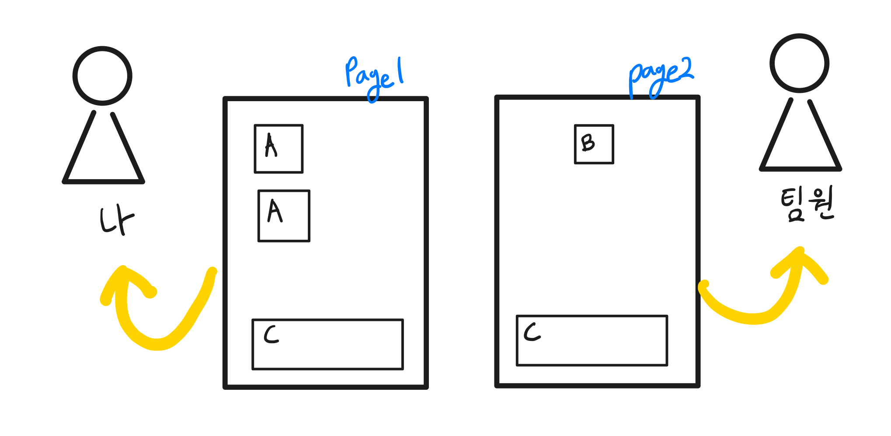
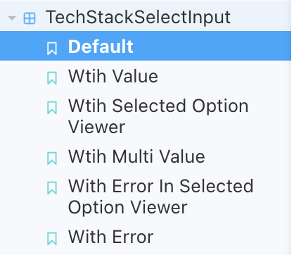
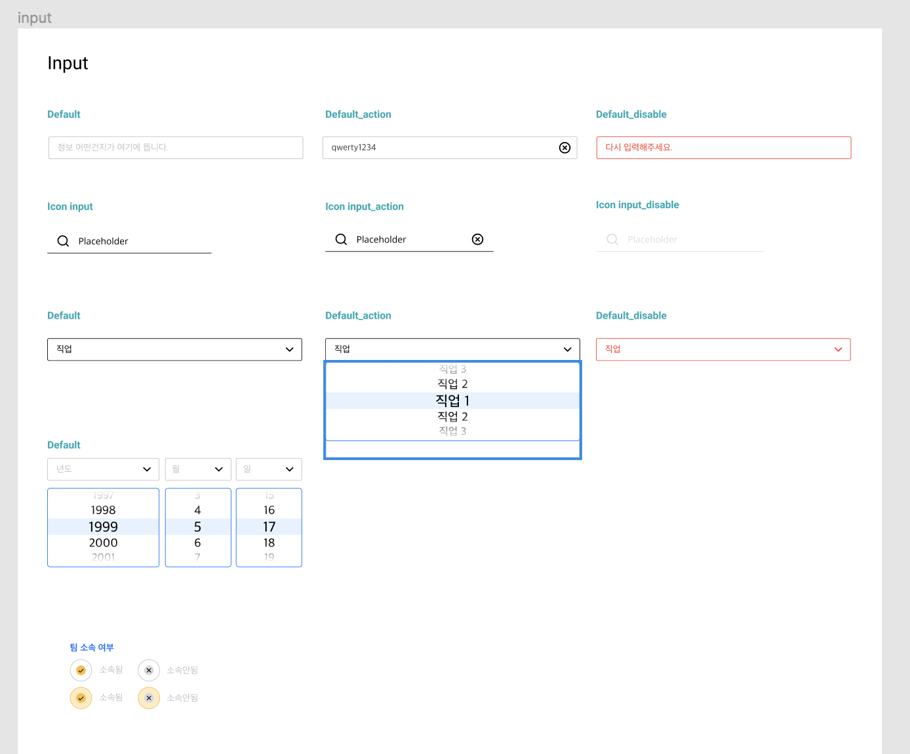
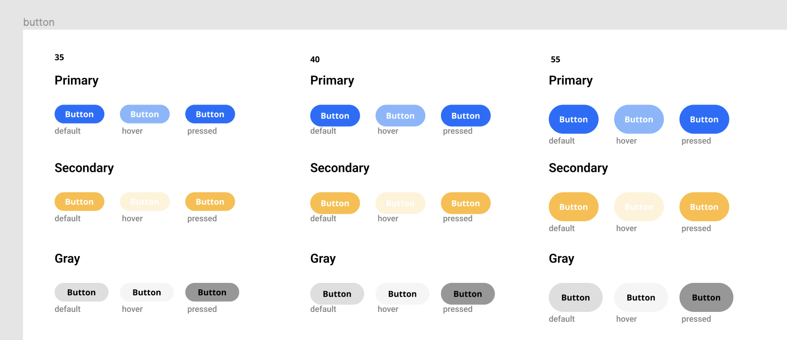
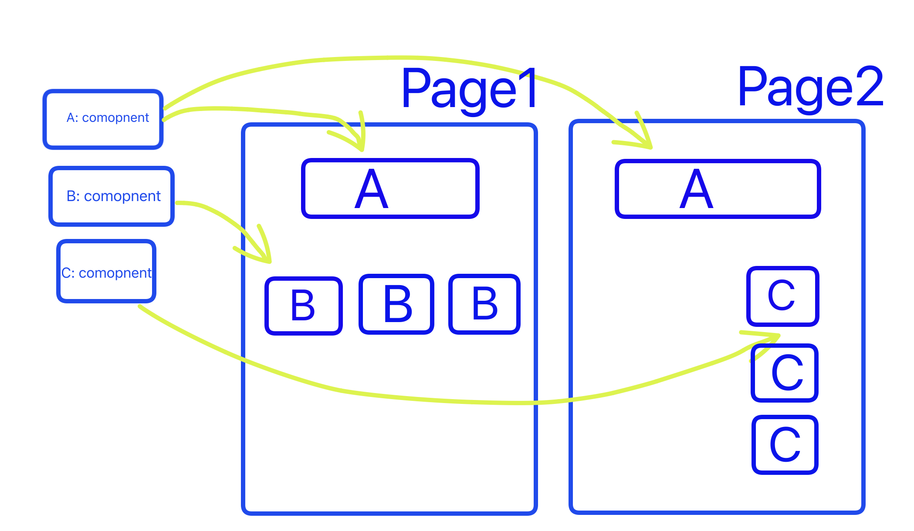

프로젝트를 진행하며 스토리북을 활용한 컴포넌트 주도 개발에 대해 고민해보고, 프론트 개발자로서 디자이너와 협업하는 과정에 대해 고민해봤습니다.

이번 글에서는 스토리북을 사용해보고 느낀 점에 대해 공유해보고자 합니다.

## 1. 스토리 북을 사용하게 된 이유

스토리북을 사용하기 전 프로젝트를 진행하면서 FE개발 과정에서 두 가지 불편한 점이 있었습니다.

### 문제1 : 번거로운 개발 과정

UI를 개발하기 위해서 react 전체 코드를 실행시켜야 했습니다. 전체 코드를 npm start 명령어로 실행시킨 뒤, 해당 컴포넌트가 있는 위치까지 이동해서 UI를 확인해야 했습니다.

정적인 UI가 아니라 `API 요청에 따른 상태 변화`(로딩, 에러)나 `조건에 따른 상태 변화`를 포함한 UI라면 해야 할 일은 더 많아졌습니다. 네트워크 속도를 느리게 해서 로딩 UI를 확인하거나, 에러 상태를 반환하게 조작해 에러 UI를 확인해야 했습니다. 변수를 직접 조작하고, 코드를 수정한 뒤 변경된 UI를 확인하기 위해 새로고침을 하거나 react를 다시 실행해야 해서 번거로웠습니다.

### 문제2: 페이지 단위 개발



스토리북을 사용하기 전 프로젝트에서 FE팀은 주로 페이지 단위로 개발했습니다. 공통 로직 (api 연결, custom hooks 개발 등등)을 제외한 UI 개발을 하기 위해 도메인별로 파트를 나누어(ex: 가입자, 팀) 개발했습니다. 결론적으로 봤을 때, 페이지 단위 개발은 장점보다는 단점이 두드러졌습니다.

개발 단위가 크다 보니 작업이 완료되기까지 시간이 오래 걸렸습니다. 페이지 단위로 작업을 나누면서 도메인과 상관없이 반복되는 UI(버튼, 인풋 박스 등)를 각자 만드는 경우가 많았습니다. 한 명의 작업이 완료될 때까지 기다렸다가 해당 컴포넌트를 쓰기에는 `개발 단위가 크다`보니 다른 한 명이 기다리는 시간이 길어졌습니다. (물론 계획을 잘 세웠으면 해결할 수 있는 문제일 수도 있지만, 첫 프로젝트에서 체계적인 계획을 세우는데 미흡한 부분이 있었습니다.)

페이지 단위 개발의 가장 큰 단점은 `재사용에 대해 무관심`하게 된다는 점이라고 느꼈습니다. GNB(Global navigation bar)와 같은 특정 컴포넌트가 아니라면 페이지 담당자가 전담해서 개발하기 때문에 재사용성 혹은 커스텀을 위한 설계에 대해 생각하지 못했습니다.

## 2. FE 컴포넌트 단위 개발을 적용해보자!

이러한 고민을 하고 개발하던 도중 Storybook에 대해서 알게 되었습니다.

> StoryBook은 Components와 State UI를 구성하여 모든 주요 View 레이어에 대한 UI 개발, 테스트 및 문서를 구성합니다 - [공식 문서](https://storybook.js.org)

스토리북이란 컴포넌트 기반의 view를 위한 독립적인 UI를 제공하는 개발도구입니다. 저는 컴포넌트 개발 현황을 확인하고 문서화하기 위해 사용했지만, 그 외 다른 다양한 활용 방법이 있습니다. 저는 여러 기능 중 스토리(story)를 주로 활용했습니다.

스토리북은 `스토리(story)라고 불리는 특정 상태에 따른 컴포넌트 UI`를 제공합니다. 여러 상태에 따른 스토리(story)를 작성해두면 같은 컴포넌트에서 여러 상태에 따라 달라지는 UI를 확인하기 위해 변수를 하나하나 조작하는 수고로움을 줄일 수 있습니다.

### 문제1 해결: 스토리를 통한 개발환경 개선

**독립적인 UI 개발 과정 확인**

스토리북은 UI 컴포넌트를 독립적인 환경에서 제공해줍니다. react 프로젝트 전체를 다시 실행하지 않고 storybook만 실행키는 것만으로도 개발과정의 번거로움이 많이 줄었습니다.

**컴포넌트를 가볍게 하기**

여러 상태에 따른 스토리를 관리하다 보면 자연스럽게 `순수한 UI 컴포넌트를 분리`하게 되었습니다.

API 요청이 포함된 컴포넌트 혹은 (지역) 상태 관리 로직이 섞여 있는 컴포넌트를 스토리로 사용하다 보면 여러 에러 메시지로 인해 스토리로 사용할 수 없었습니다. `하나의 컴포넌트가 API 요청, 상태 관리 등의 다양한 일을 하는 게 원인`이었습니다. 스토리북은 개발하고 있는 프로젝트와 독립된 환경이기 때문에 정상적인 작동을 위한 mocking이 필요합니다. 스토리북에서 제공하는 [에드온](https://storybook.js.org/docs/react/configure/storybook-addons)을 통해 이와 같은 문제를 해결할 수도 있지만 저희 팀은 더욱 근본적인 질문을 통해 문제를 해결해봤습니다.

> “하나의 컴포넌트가 너무 많은 일은 하는 게 아닐까?”

“단일 책임 원칙”이라는 유명한 리팩토링 원칙과 같은 맥락입니다. return 문에 jsx가 있는 react 컴포넌트에서 js와 html을 완벽하게 분리할 수 없지만, 하나의 컴포넌트라도 `js 로직이 있는 부분과 view(jsx)를 나누어 설계`할 수 있었습니다.



**피그마의 컴포넌트의 동기화**

피그마에 디자이너분이 만들어주신 컴포넌트별 상황에 맞는 스토리를 작성할 수 있었습니다. 에러 상황, hover, disable 등 상태에 따른 UI를 스토리로 만들어 관리하면서 디자이너분과 작업 상황을 공유할 수 있었습니다.





### 문제2 해결: 컴포넌트 주도 개발

스토리북을 사용하면서 컴포넌트를 기반으로 개발하게 되었습니다. 작은 단위의 컴포넌트를 만들고 조합하는 방식으로 개발하다 보니 다음과 같은 장점이 이었습니다.



**재사용성 및 추상화**

Button, TextInput, SelectInput, TextArea 등의 도메인과 상관없는 컴포넌트들은 여러 페이지에서 사용해야 했습니다. 여러 곳에서 쓰이기 때문에 한 번 만들 때 재사용성을 고려해 적절하게 추상화해야 했습니다. 추상화된 컴포넌트로 여러 페이지에서 반복되는 코드를 줄일 수 있었습니다. 또한, 다른 팀원이 작업한 내용이더라도 코드를 이전보다 쉽게 이해하고 사용할 수 있었습니다.

```jsx
<SelectInput
  name="job"
  label="직업"
  placeHolder="직업"
  defaultOption={defaultJobOption}
  options={jobOptions}
  value={inputValues.job}
  onChange={onChangeHandlerWithSelect}
/>
<TextInput
  name="slogan"
  label="슬로건"
  placeholder="슬로건"
  value={inputValues.slogan}
  onChange={onChangeHandler}
  isError={isSloganValidateError}
  helperText={validateError.slogan}
/>
```

**컴포넌트 폴더 구조와 페이지 폴더의 관계 확립**

재사용성 고려한 컴포넌트 개발은 폴더 간 구조를 명확히 하는 데 도움이 되었습니다.

```bash
# 이전
└── src
    ├── components # component들을 모아놓은 폴더
    ├── pages # 컴포넌트를 조합하여 만든 route에서 사용하는 페이지

# 이후
└── src
    ├── components # component들을 모아놓은 폴더
    │     ├── Common # 비즈니스 로직과 관계없이 범용적으로 사용하는 컴포넌트
    │     │   ├── Button
    │     │   └── CheckInput
    │     │ # 비즈니스 로직과 관련있는 특정 페이지에서 사용하는 컴포넌트
    │     ├── TeamCard
    │     └── UserCard
    ├── pages # 컴포넌트를 조합하여 만든 route에서 사용하는 페이지

```

## 3. 프로젝트에서 적용한 방식

앞서 언급한 내용처럼 스토리북을 사용하면서 `순수한 UI 컴포넌트`를 분리하기 위해 노력했습니다.

```bash
.
└── Component
    ├── Component.stories.jsx
    ├── Component.style.js
    └── index.jsx
```

컴포넌트 구조가 깊어지게 되거나, 컴포넌트 내부에서 API 호출이나 상태 관리 로직을 사용해야 하는 경우 아래와 같이 `순수한 view로 최대한 분리`하면서 사용했다.

```bash
.
└── Component
    ├── Component.stories.jsx # Component.view.jsx를 Import 해서 사용
    ├── Component.style.js
    ├── Component.view.jsx
    └── index.tsx
```

## 4. 프로젝트에 적용하면서 겪은 문제점

여러 컴포넌트를 조합해서 페이지를 만들 때, 해당 페이지에 대한 스토리를 만들면서 문제가 생겼습니다. 조합하는 과정에서 에러가 발생하기도 했지만 `API를 포함한 컴포넌트의 스토리`를 만들 때 문제가 해결하기 어려웠습니다.

몇몇 컴포넌트들은 순수한 view가 아닌 내부에서 API를 호출하고 있었는데, 페이지 스토리를 만들 때 API 요청이 포함된 컴포넌트를 사용하다 보니 API 관련 에러가 발생했습니다. Text Input처럼 모든 상태를 외부에서 넘겨받는 컴포넌트라면 문제가 되지 않았습니다. 아래와 같이 외부 상태에 따라 스토리를 작성할 수 있기 때문입니다.

```jsx
export const Default = Template.bind({})
Default.args = {
  name: 'Default',
  placeholder: 'Default',
}

export const WithError = Template.bind({})
WithError.args = {
  name: 'Error',
  placeholder: 'Error',
  isError: true,
  helperText: '에러 입니다.',
}
```

하지만 `컴포넌트 내부 조건에 따라 UI를 변경`해야 할 때 문제가 발생했습니다. 예시로 문제를 알아보겠습니다.


A 영역과 B 영역 모두 <TechStackSelectInput /> 내부에서 호출되는 API 상태에 따라 UI가 변동됩니다. (최초 렌더링 시 B 영역이 닫혀 있는 상태일 수도 있어서 A 영역에서도 API 상태에 따른 UI를 표시했습니다) B 영역에 표시되는 서비스에 등록된 기술 스택을 호출하는 API이기 때문에 API를 컴포넌트 외부로 두면 응집도가 떨어진다고 생각했습니다.


### MSW와 연동하여 API 의존성 주입하기

위의 예시처럼 컴포넌트 내부에서 어쩔 수 없이 API를 요청하는 경우 [msw addon](https://storybook.js.org/addons/msw-storybook-addon)을 사용하기로 했습니다. Mocking API를 위해 MSW를 사용하고 있는 상황에서 쉽고 빠르게 적용할 수 있었습니다.

**설치**

```bash
npm i -D msw-storybook-addon
```

```jsx
// .storybook/main.js
// 생략
import { initialize, mswDecorator } from 'msw-storybook-addon'

// Initialize MSW
initialize()

export const decorators = [mswDecorator, Story => <Story />]
```

**사용법**

`src/mocks/handler`에서 export하고 있는 msw handler를 storybook에서 사용하기

```jsx
import handlers from 'mocks/handlers'
import TechStackSelectInput from './index'

export default {
  title: 'Component/TechStackSelectInput',
  component: TechStackSelectInput,
  parameters: {
    msw: handlers,
  },
  layout: 'fullscreen',
}

// 생략
```

## 5. 여전히 남은 문제점

위와 같은 과정을 통해 UI 개발 과정도 향상되고 좋은 컴포넌트에 대한 고민을 할 수 있었습니다. 개발 과정은 좋아졌지만 아쉬운 점도 있었습니다. 작성해야 하는 기본 코드양이 많아지고, 다양한 기능을 활용하고 싶어 찾아보다 학습 비용이 많이 들었습니다. 또한, 애매하게 추상화하거나 재사용성을 고려하면 코드만 길어지고 사용하는 입장에서도 해당 컴포넌트가 무슨 기능을 하는지 알아보기 어려웠습니다.

여러 불편한 점들 가운데 `개발한 UI를 팀원 간 공유하는 과정`에서 불편함이 가장 컸습니다.

- PR 보낼 때 UI를 확인하기 위해 해당 repo를 로컬로 받아와서 직접 확인해야 한다.
- 디자이너분께 개발 진행 상황을 전달할 방법이 부족하다.

스토리북을 활용해 UI 개발 진행 현황을 공유할 방법이 없을까 고민하다가 공식 문서에서 [chromatic](https://storybook.js.org/docs/react/sharing/publish-storybook#publish-storybook-with-chromatic)을 활용한 배포 방법을 알게 되었습니다. 이에 관한 내용은 다음 포스트에서 이어서 작성하겠습니다!

## 참고 자료

[https://storybook.js.org/tutorials/design-systems-for-developers/react/ko/introduction/](https://storybook.js.org/tutorials/design-systems-for-developers/react/ko/introduction/)

[https://medium.com/@songc/번역-storybook-6-0-b7d0653fd97b](https://medium.com/@songc/%EB%B2%88%EC%97%AD-storybook-6-0-b7d0653fd97b)
