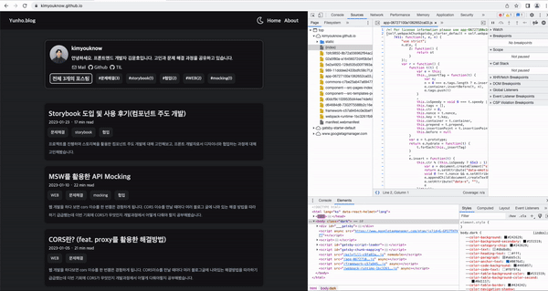
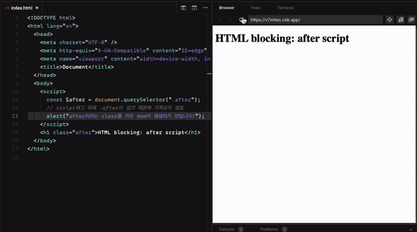
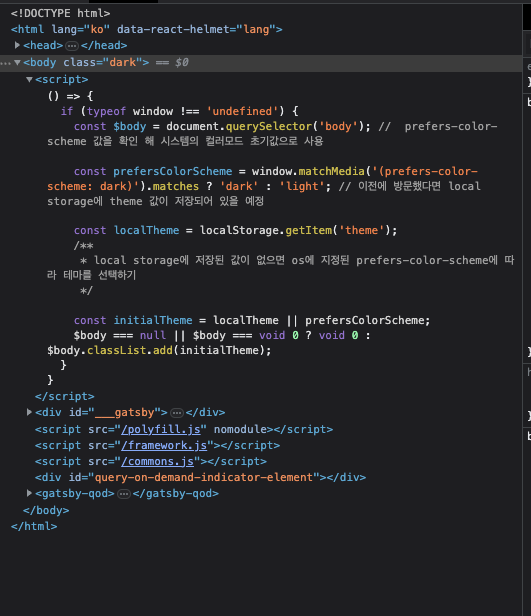
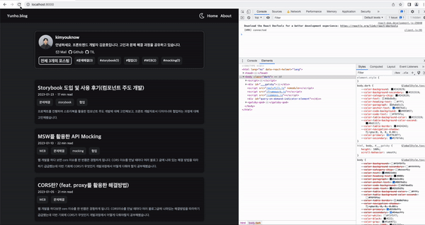
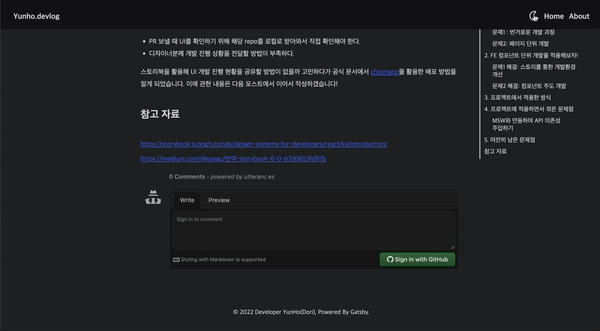

## 요약

CSS 변수를 활용한 다크모드 개발 과정을 소개합니다. 초기 렌더링 시 깜빡이는 에러(dark mode flash)와 iframe 댓글 컴포넌트(utterance, giscus)에 다크모드가 적용되지 않은 에러를 해결했습니다.

## 1. 다크모드란?

다크모드란, 소프트웨어 UI에서 어두운색의 테마를 사용할 수 있는 기능입니다. 저는 보통 핸드폰과 PC 모두 다크모드로 사용합니다. 자주 사용하는 기능이 제 블로그에도 있으면 좋을 것 같아 개발하게 되었습니다.

저는 `CSS 변수를 활용해 서비스에 다크모드를 적용`했습니다. 해당 방법으로 React 기반의 어플리케이션 뿐만 아니라 다양한 환경에서 CSS 변수를 통해 다크모드를 제어할 수 있습니다.

그럼 gatsby 블로그에서 CSS 변수로 다크모드를 제어하기까지 과정을 설명해보겠습니다. 글의 순서는 핵심 기능 구현과 에러 해결로 구성했습니다.

제가 원하는 다크모드의 핵심 기능은 2가지입니다.

1. 사용자가 별도의 설정을 하지 않았으면 OS 설정을 가져온다.
2. 사용자가 별도의 설정을 했다면 OS 설정보다 우선순위로 적용한다.

## 2. OS 설정 가져오기

1번 기능(사용자가 별도의 설정을 하지 않았으면 OS 설정을 가져온다.)을 구현하기 위해 사용자 시스템의 테마를 감지해야 합니다.

**[prefers-color-scheme](https://developer.mozilla.org/en-US/docs/Web/CSS/@media/prefers-color-scheme)** CSS 미디어 쿼리 특성을 활용하면 사용자의 시스템이 라이트 테마나 다크 테마를 사용하는지 탐지할 수 있습니다. 아래와 같이 미디어 속성을 활용해 다크모드일 때 적용할 배경 색깔을 정의할 수 있습니다.

```scss
:root {
  background-color: white;
}

@media (prefers-color-scheme: dark) {
  :root {
    background-color: black;
  }
}
```

사용자 시스템의 테마를 Javascript로 다루기 위해서는 [Window.matchMedia](https://developer.mozilla.org/ko/docs/Web/API/Window/matchMedia) 속성을 사용해야 합니다. Window.matchMedia API는 미디어 쿼리 문자열의 분석결과를 반환합니다. 결과 값 중 matches를 활용해 현재 사용자 시스템의 테마를 정의할 수 있습니다.

```tsx
window.matchMedia('(prefers-color-scheme: dark)')
// MediaQueryList {media: '(prefers-color-scheme: dark)', matches: true, onchange: null}

const prefersColorScheme = window.matchMedia('(prefers-color-scheme: dark)').matches ? 'dark' : 'light'
```

## 3. CSS를 적용하는 방법 2가지

사용자 시스템을 감지했다면 필요한 색깔을 정하고 서비스에 사용자 시스템에 따른 CSS 적용해야합니다.

### 3-1. CSS 적용 방법1: ThemeProvider

현재 블로그에는 [Emotion의 Theming](https://www.notion.so/feat-css-variable-a763952c74964520a6c6a274dcd77dd1)을 활용해서 글꼴 및 색깔 스타일을 적용하고 있습니다. 디자인과 관련된 토큰을 `styles/theme.ts` 파일에 지정해두고, `Theme Provider`로 컨텍스트를 묶어 필요한 컴포넌트에서 인라인 함수로 테마 관련 속성에 접근할 수 있습니다. 다크모드도 `각 테마에 대응되는 색상 객체를 만들어 Theme Provider를 전달하여 Theming이 가능`합니다.

ThemeProvider를 활용했을 때 제가 느낀 장단점은 아래와 같습니다.

장점

- 타입을 지정해 정적 타이핑의 이점이 있습니다.

단점

- 스타일을 적용하기 위한 코드 작업이 많습니다.(속성, 타입, 인라인 함수)

적용 결과

<iframe src="https://codesandbox.io/embed/darkmode-theme-provider-2wbv2y?fontsize=14&hidenavigation=1&theme=dark"
     style="width:100%; height:500px; border:0; border-radius: 4px; overflow:hidden;"
     title="darkmode-Theme Provider"
     allow="accelerometer; ambient-light-sensor; camera; encrypted-media; geolocation; gyroscope; hid; microphone; midi; payment; usb; vr; xr-spatial-tracking"
     sandbox="allow-forms allow-modals allow-popups allow-presentation allow-same-origin allow-scripts"
   ></iframe>

<details>
<summary>적용 코드 (아래로 펼쳐주세요 ⬇️)</summary>

```ts
// styles/themeMode.ts
export type ThemeMode = {
  background: string
  backgroundSecond: string
  text: string
}

/**
 * light theme
 */
export const lightTheme: ThemeMode = {
  background: '#f3f5f7',
  backgroundSecond: '#ffffff',
  text: '#00214d',
}
/**
 * dark theme
 */
export const darkTheme: ThemeMode = {
  background: '#242629',
  backgroundSecond: '#151519',
  text: '#dbdbd',
}

// hooks/useThemeMode.ts
const isDarkPrefersMode = window.matchMedia('(prefers-color-scheme: dark)').matches

const useThemeMode = () => {
  const [isDarkMode, setIsDarkMode] = useState(isDarkPrefersMode)

  const themeToggler = () => setIsDarkMode(prev => !prev)
  return { isDarkMode, themeToggler }
}

export default useThemeMode

// styles/index.tsx
const Styles = ({ children }: StylesProps) => {
  const { isDarkMode } = useThemeMode()
  return (
    <ThemeProvider theme={{ ...theme, mode: isDarkMode ? darkTheme : lightTheme }}>
      <GlobalStyle />
      {children}
    </ThemeProvider>
  )
}

export default Styles

// components/ThemeSwitchButton.tsx
const ThemeSwitchButton = () => {
  const { isDarkMode, themeToggler } = useThemeMode()

  return <S.ThemeSwitchButton onClick={themeToggler}>{isDarkMode ? <FaRegMoon /> : <FiSun />}</S.ThemeSwitchButton>
}

// components/ThemeSwitchButton.style.ts
export const ThemeSwitchButton = styled.button`
  background-color: ${({ theme: { mode } }) => mode.background};
  color: ${({ theme: { mode } }) => mode.text};
`
```

</details>

### 3-2. CSS 적용 방법2: CSS 변수 (선호)

저는 Theme Provider를 활용한 방식보다 CSS 변수를 활용한 스타일을 선호합니다. (CSS 변수에 대한 내용은 따로 다뤄보겠습니다) `CSS 변수를 활용하면 각 테마에 대응되는 색상을 정의해놓고 사용하고자 하는 컴포넌트에서 CSS 변수로 스타일을 지정하여 사용`할 수 있습니다. Theming과 유사하게 스타일 관련 속성을 한 곳에서 정의할 수 있습니다. 색깔을 변경하고 싶다면 GlobalStyle에 설정한 색상만 수정하면 됩니다.

CSS 변수를 활용했을 때 제가 느낀 장단점은 아래와 같습니다.

장점

- ⭐️ 반응성이 좋습니다. CSS 변수가 변경되면 html에 즉시 반영됩니다. (다크모드 및 반응형 웹을 구현할 때 도움이 됩니다.)
- 스타일을 적용하기 위해 css 작업만 하면 됩니다.
- Javascript에 의존적이지 않습니다. (다크모드 flash 현상을 해결할 때 도움이 됩니다.)

단점

- 타입 지정이 안 됩니다. (자동완성이 되지 않습니다.)

적용 결과

<iframe src="https://codesandbox.io/embed/darkmode-css-variable-tbg4wg?fontsize=14&hidenavigation=1&theme=dark"
     style="width:100%; height:500px; border:0; border-radius: 4px; overflow:hidden;"
     title="darkmode-css variable"
     allow="accelerometer; ambient-light-sensor; camera; encrypted-media; geolocation; gyroscope; hid; microphone; midi; payment; usb; vr; xr-spatial-tracking"
     sandbox="allow-forms allow-modals allow-popups allow-presentation allow-same-origin allow-scripts"
   ></iframe>

<details>
<summary>적용 코드 (아래로 펼쳐주세요 ⬇️)</summary>

```ts
// styles/themeMode.ts
export type ThemeMode = {
  background: string
  backgroundSecond: string
  text: string
}

/**
 * light theme
 */
export const lightTheme: ThemeMode = {
  background: '#f3f5f7',
  backgroundSecond: '#ffffff',
  text: '#00214d',
}
/**
 * dark theme
 */
export const darkTheme: ThemeMode = {
  background: '#242629',
  backgroundSecond: '#151519',
  text: '#dbdbd',
}

// hooks/useThemeMode.ts
const isDarkPrefersMode = window.matchMedia('(prefers-color-scheme: dark)').matches

const useThemeMode = () => {
  const [isDarkMode, setIsDarkMode] = useState(isDarkPrefersMode)

  const themeToggler = () => setIsDarkMode(prev => !prev)
  return { isDarkMode, themeToggler }
}

export default useThemeMode

// styles/index.tsx
const Styles = ({ children }: StylesProps) => {
  const { isDarkMode } = useThemeMode()
  return (
    <ThemeProvider theme={{ ...theme, mode: isDarkMode ? darkTheme : lightTheme }}>
      <GlobalStyle />
      {children}
    </ThemeProvider>
  )
}

export default Styles

// components/ThemeSwitchButton.tsx
const ThemeSwitchButton = () => {
  const { isDarkMode, themeToggler } = useThemeMode()

  return <S.ThemeSwitchButton onClick={themeToggler}>{isDarkMode ? <FaRegMoon /> : <FiSun />}</S.ThemeSwitchButton>
}

// components/ThemeSwitchButton.style.ts
export const ThemeSwitchButton = styled.button`
  background-color: ${({ theme: { mode } }) => mode.background};
  color: ${({ theme: { mode } }) => mode.text};
`
```

</details>

## 4. OS 설정과 사용자 설정 우선순위 정하기

OS 설정에 따라 다크모드를 적용해봤습니다. 하지만 **[prefers-color-scheme](https://developer.mozilla.org/en-US/docs/Web/CSS/@media/prefers-color-scheme)** CSS 미디어 쿼리를 활용하기 때문에 자체적인 사용자 설정에 한계가 있습니다.

이제 2번 기능(사용자가 별도의 설정을 했다면 OS 설정보다 우선순위로 적용한다.)을 구현해볼 차례입니다.

> 사용자가 최초로 방문했다면 OS 설정에 따르고, 사용자가 방문한 기록이 있다면 해당 기록에 따라 테마를 설정하자

사용자가 OS 설정과 별도로 모드를 입력하고 싶을 때 어떻게 해야 할까요? Theme Provider를 사용한다면 위의 예시 코드처럼 JS 로직으로 제어할 수 있습니다. 하지만 CSS 변수를 활용한 방법을 사용하려면 약간의 트릭이 필요합니다.

바로 `body 태그에 현재 테마와 관련된 정보를 저장`하는 방법입니다. 저는 body 태그에 class=”dark”라는 정보가 있을 때 다크모드가 설정되게 구현했습니다. (유튜브와 깃허브는 html에 dark attribute를 적용하는 방법으로 자체적인 테마 모드를 제공하고 있습니다) 이렇게 하면 JS로 DOM을 다룰 수 있기 때문에 사용자 설정을 반영하기 용이합니다.

구체적인 로직은 아래와 같습니다.

- local storage에 저장된 값이 있으면 해당 값으로 테마를 설정하기
- local storage에 저장된 값이 없으면 OS에 지정된 prefers-color-scheme에 따라 테마를 설정하기
- 초기 테마를 정하면 body 태그에 테마에 맞는 class를 추가해서 css-variable 적용하기

<details>
<summary>적용 코드 (아래로 펼쳐주세요 ⬇️)</summary>

```tsx
import { isBrowser } from '@/utils'

import browserStorage from './browserStorage'

const THEME_MODE_DARK = 'dark' as const
const THEME_MODE_LIGHT = 'light' as const

type ThemeMode = typeof THEME_MODE_DARK | typeof THEME_MODE_LIGHT

export interface ThemeModeType {
  $body: HTMLElement | undefined
  isDarkMode: boolean
  themeMode: ThemeMode
  themeToggler: () => void
}

//  prefers-color-scheme 값을 확인해 시스템의 컬러 모드 초기 값으로 사용
const prefersColorScheme = isBrowser && window.matchMedia('(prefers-color-scheme: dark)').matches ? 'dark' : 'light'
// 이전에 방문했다면 local storage에 theme 값이 저장되어 있을 예정
const localTheme = browserStorage.get('theme') as ThemeMode

/**
 * local storage에 저장된 값이 없으면 os에 지정된 prefers-color-scheme에 따라 테마를 선택하기
 */
const initialTheme = localTheme || prefersColorScheme

class ThemeModeHandler implements ThemeModeType {
  $body: HTMLElement | undefined
  isDarkMode: boolean
  themeMode: ThemeMode
  constructor() {
    this.$body = isBrowser ? (document.querySelector('body') as HTMLElement) : undefined
    this.isDarkMode = initialTheme === THEME_MODE_DARK
    this.themeMode = initialTheme
    this.setInitMode()
  }
  setInitMode() {
    this.$body?.classList.add(initialTheme)
  }
  themeToggler() {
    this.isDarkMode = this.$body!.classList.contains(THEME_MODE_DARK)
    if (this.isDarkMode) {
      this.setMode(THEME_MODE_LIGHT)
    } else {
      this.setMode(THEME_MODE_DARK)
    }
  }
  setMode(themeMode: ThemeMode) {
    this.$body?.classList.remove(THEME_MODE_LIGHT, THEME_MODE_DARK)
    this.$body?.classList.add(themeMode)
    browserStorage.set('theme', themeMode)
    this.isDarkMode = themeMode === THEME_MODE_DARK
    this.themeMode = themeMode
  }
}

const themeModeHandler = new ThemeModeHandler()

export default themeModeHandler
```

</details>

## 5. 에러1: 초기 렌더링 시 깜빡이는 에러(dark mode flash)

다크모드가 잘 적용됐나 싶었지만 문제가 있었습니다. 시스템 설정과 사용자 설정이 다를 때 화면이 깜박거리는 현상이 발생했습니다. (라이트모드 시스템 설정에서 사용자는 다크모드를 선택한 상황을 예시로 들어보겠습니다.)



개발자 도구를 열어서 확인해본 결과 `렌더링 과정`에서 생기는 문제였습니다. 현재 다크모드는 아래와 같은 과정을 거쳐 적용되고 있었습니다.

- **1번. html이 렌더링되어 다크모드가 적용되기까지 기본 설정인 라이트모드가 적용된 화면이 보입니다.**
- **2번. DOM이 렌더링된 후 JS로직이 실행되면 다크모드가 적용됩니다.**

이러한 과정에서 최초로 DOM이 렌더링되고 난 시점부터 JS로직(body 태그에 theme관련 class를 추가하기)이 실행되는 시점까지 차이가 있기 때문에 발생한 문제였습니다.

그렇다면 DOM이 렌더링 되기 전에 미리 사용자의 선호 테마를 확인하면 될 수 있지 않을까요? 하지만 `Gatsby와 같은 서버 렌더링 컨텍스트에서는 HTML이 사용자 기기에 도달하기 훨씬 전에 생성`되기 때문에 사용자가 어떤 테마를 선호하는지 미리 알기 어려웠습니다.

### 5-1. HTML Blocking으로 해결하기

[The Quest for the Perfect Dark Mode](https://www.joshwcomeau.com/react/dark-mode/#blocking-html-6) 포스트에서 힌트를 얻어 DOM을 렌더링하기 전 테마를 파악하는 방법을 알아냈습니다! 바로 HTML Blocking을 활용한 방법입니다.

해당 문제를 해결하기 위해서는 약간의 브라우저 렌더링에 관한 사전지식이 필요합니다. 브라우저가 렌더링하는 과정에서 제일 먼저 HTML 파싱작업이 이뤄집니다. `브라우저는 HTML 파싱을 하는 도중 별도의 속성을 지정하지 않은 script 태그를 만나면 DOM 생성을 중단합니다.` 이러한 현상은 DOM 접근 JS 로직에서 에러를 발생하거나 무거운 script 태그를 다운받으면서 렌더링을 방해하는 부작용을 야기합니다.

하지만! 이러한 script 태그의 속성을 활용해 DOM을 렌더링하기 전에 테마를 파악하는 JS 로직을 실행할 수 있습니다. 아래 예시를 보면 h1 태그가 렌더링 되기 전에 alert가 찍히는 것을 확인할 수 있습니다.

```jsx
 <body>
  <h1 class="before">before script</h1>
  <script>
    const $after = document.querySelector(".after");
    // script태그 뒤에 .after이 있기 때문에 가져오지 않는다.
    if (!$after) {
      alert("after이라는 class를 가진 dom이 생성되기 전입니다!");
    }
  </script>
  <h1 class="after">HTML blocking: after script</h1>
</body>
```

예제 출처: [https://www.joshwcomeau.com/react/dark-mode/#blocking-html-6](https://www.joshwcomeau.com/react/dark-mode/#blocking-html-6)



### 5-2. 실제 적용

Gatsby의 [SSR API](https://www.gatsbyjs.com/docs/reference/config-files/gatsby-ssr/)를 활용하면 빌드 과정에서 각 페이지 별로 HTML 파일을 생성할 때, body 태그 전에 script 컴포넌트를 삽입할 수 있습니다. gatsby-srr.js에서 아래와 같이 `onRenderBody`와 `setPreBodyComponents`를 활용하면 body 태그 전에 테마를 설정하는 JS 로직을 삽입할 수 있습니다.

```jsx
// gatsby-srr.js
const setInitThemeMode = () => {
  // 초기 테마 설정 로직 : src/utils/themeMode.ts와 같은 로직
}
const functionToScript = callbackFn => String(callbackFn)

const setInitThemeModeScript = functionToScript(setInitThemeMode)
const codeRunOnClient = `(${setInitThemeModeScript})()`

const PreBodyScript = () => {
  return <script dangerouslySetInnerHTML={{ __html: codeRunOnClient }} />
}

export const onRenderBody = ({ setPreBodyComponents }) => {
  setPreBodyComponents(<PreBodyScript key="setInitThemeMode-script" />)
}
```

`onRenderBody`

- 빌드 중 HTML을 생성할 때 이 기능을 실행합니다.

`setPreBodyComponents`

- body 태그 안의 React로 만든 컴포넌트 앞에 요소를 삽입할 수 있습니다.

`PreBodyScript`:

- 브라우저 DOM에서 `innerHTML`을 사용하기 위한 React의 대체 방법입니다.
- 일반적으로 코드에서 HTML을 설정하는 것은 [사이트 간 스크립팅](https://ko.wikipedia.org/wiki/%EC%82%AC%EC%9D%B4%ED%8A%B8_%EA%B0%84_%EC%8A%A4%ED%81%AC%EB%A6%BD%ED%8C%85)  공격에 쉽게 노출될 수 있기 때문에 위험합니다. 따라서 React에서 직접 HTML을 설정할 수는 있지만, 위험하다는 것을 상기시키기 위해 `dangerouslySetInnerHTML`을 작성하고 `__html` 키로 객체를 전달해야 합니다. ([React : dangerouslySetInnerHTML](https://ko.reactjs.org/docs/dom-elements.html#dangerouslysetinnerhtml))

`codeRunOnClient`:

- 컴파일 타임에 주입되지만 런타임에만 실행되는 코드를 위한 처리입니다.

개발자도구에서 빌드된 결과를 보면 script 태그가 gatsby 결과물보다 위에 삽입된 것을 확인할 수 있습니다.



### 5-3. 해결 결과!

HTML Blocking을 활용해 메인 DOM이 렌더링 되기 전에 CSS 변수를 적용할 수 있게 되었습니다.



## 6. 기타 에러 2: 댓글(utterance, giscus) 컴포넌트에 다크모드가 적용되지 않는 에러

댓글 컴포넌트의 경우 iframe 태그를 활용해서 렌더링하고 있습니다. iframe에 제가 설정한 CSS 변수를 적용할 수 없어 `isDark`라는 전역 상태를 두고 상태가 변경될 때마다 다시 댓글 컴포넌트를 렌더링했습니다. 하지만 아래와 같이 기존 컴포넌트가 제거되지 않고 새로운 컴포넌트가 쌓이는 현상이 발생했습니다.



다행히 해당 문제가 [giscus 이슈(Dynamic theme changing available?)](https://github.com/giscus/giscus/issues/336)에 이미 등록되어 있어 쉽게 해결할 수 있습니다. **`window.postMessage()`** 메소드를 활용하면 iframe 태그로 삽입된 자식과 부모 페이지 사이 간 통신할 수 있습니다.

```tsx
const setCommentTheme = ($iframe: HTMLIFrameElement) => {
  // version: utterance
  // const msg = {
  //   type: 'set-theme',
  //   theme: utteranceTheme,
  // }
  // iframe.contentWindow?.postMessage(msg, 'https://utteranc.es')

  // version: giscus
  const msg = { giscus: { setConfig: { theme: commentTheme } } }
  $iframe.contentWindow?.postMessage(msg, 'https://giscus.app')
}
```

## 7. 마무리

요즘에 다크모드가 눈에 좋지 않다는 말도 있지만 아직 많은 사람들이 사용하는 기능이고 대부분 서비스에서 지원하는 기능이기 때문에 직접 구현해보았습니다. 간단한 기능인 것 같았지만 고려해야할 요소도 많고 생각하지 못한 에러가 많았습니다.

CSS 변수를 활용하는 방법을 익히면서 JS에만 국한되지 않고 css 및 html 속성을 적절하게 활용해야할 필요성을 느꼈습니다. 또한, 깜박거리는 에러를 해결하는 과정에서 브라우저의 기본 동작 과정을 왜 공부해야하는지 알 수 있었습니다.

제가 구현한 방법이 최선의 방법이 아닐 수도 있지만 다크모드를 구현하는 분께 도움이 됐으면 좋겠습니다!

## 참고 자료

css 변수

- [https://developer.mozilla.org/ko/docs/Web/CSS/Using_CSS_custom_properties](https://developer.mozilla.org/ko/docs/Web/CSS/Using_CSS_custom_properties)
- [https://developer.mozilla.org/en-US/docs/Web/CSS/@media/prefers-color-scheme](https://developer.mozilla.org/en-US/docs/Web/CSS/@media/prefers-color-scheme)
- [https://developer.mozilla.org/ko/docs/Web/API/Window/matchMedia](https://developer.mozilla.org/ko/docs/Web/API/Window/matchMedia)
- [https://fe-developers.kakaoent.com/2021/211118-dark-mode/](https://fe-developers.kakaoent.com/2021/211118-dark-mode/)

blocking HTML

- [https://ko.javascript.info/script-async-defer](https://ko.javascript.info/script-async-defer)
- [https://www.joshwcomeau.com/react/dark-mode/#updating-html-in-gatsby-8](https://www.joshwcomeau.com/react/dark-mode/#updating-html-in-gatsby-8)
- [https://www.gatsbyjs.com/docs/reference/config-files/gatsby-ssr/](https://www.gatsbyjs.com/docs/reference/config-files/gatsby-ssr/)

기타

- https://github.com/utterance/utterances/issues/170
- https://github.com/giscus/giscus/issues/336
