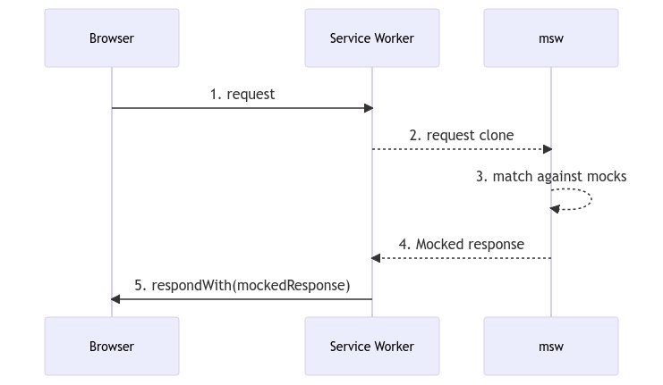
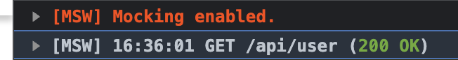

# 요약

MSW와 faker.js를 활용해 Mocking 환경을 구성해 프론트 엔드 개발 생산성을 개선해본 경험에 대한 글입니다.

MSW 및 mocking에 대한 아이디어의 대부분을 [kakao-tech: Mocking으로 생산성까지 챙기는 FE 개발](https://tech.kakao.com/2021/09/29/mocking-fe/) 해당 글을 통해 알게 되었습니다. 참고한 글만큼 전문적이지는 못하지만 제가 고민한 mocking에 대한 내용과 어떤 생각을 가지고 MSW를 도입하고 어떤 방법으로 활용했는지 공유하고자 합니다!

## 1. Mocking API를 사용한 이유

### Frontend(FE) 개발자의 입장에서 생긴 개발 병목 현상

> “000 API 언제쯤 완성되는지 알 수 있을까요???”

FE 개발을 하면서 BE 개발에 의존적인 상황이 종종 생겼습니다. BE 개발자와 함께 API 명세를 상의하고 정의했을 때, mocking 데이터와 mocking API가 만들어지기 전까지 샘플 데이터를 만들어서 개발을 진행했습니다. 샘플 데이터만 있을 때는 api 연결을 확인할 수 없어 UI 위주의 개발 작업을 진행해야 했습니다. (하지만 UI 위주의 개발 또한 디자이너의 진행 상황에 의존적이었습니다. 화면에 표시될 UI를 디자이너와 상의한 대로 간단한 배치 정도만 구성해도 디자인이 바뀌면 전체적으로 다시 수정해야 하는 문제가 발생했습니다.)

**프로젝트를 진행하면서 기획, FE, BE, 디자인 개발이 동시에 진행되다 보니 서비스의 엔드 포인트를 담당하는 FE는 의존적인 작업이 많아지고, 그에 따른 개발 진행이 더디게 되었습니다.** 그렇다고 마냥 기다릴 수 없는 상황에서 샘플 데이터와 간단한 배치만 하고 FE 개발을 진행했습니다. API가 완성되거나 디자인이 완성되면 FE 코드를 수정해야 하는 일이 빈번했고, 같은 로직에 대한 작업을 2, 3번씩 하는 경우가 많았습니다. 또한, API가 완성되고 나서야 API 설계에 대한 오류를 찾을 수 있어 피드백 작업이 늦어졌습니다.

**프로젝트를 진행하면서 기획, FE, BE, 디자인 개발이 동시에 진행되다 보니 서비스의 엔드 포인트를 담당하는 FE는 의존적인 작업이 많아지고, 그에 따른 개발 진행이 더디게 되었습니다.** 그렇다고 마냥 기다릴 수 없는 상황에서 샘플 데이터와 간단한 배치만 하고 FE 개발을 진행했습니다. API가 완성되거나 디자인이 완성되면 FE 코드를 수정해야 하는 일이 빈번했고, 같은 로직에 대한 작업을 2, 3번씩 하는 경우가 많았습니다. 또한, API가 완성되고 나서야 API의 설계에 대한 오류를 찾을 수 있어 피드백 작업이 늦어졌습니다.

### FE에서 Mocking 해서 병목 현상을 해결하자!

어떻게 하면 다른 팀 작업 현황에 종속적이지 않고, 생산성 있는 개발을 할 수 있을까 고민하던 도중 [kakao-tech: Mocking으로 생산성까지 챙기는 FE 개발](https://tech.kakao.com/2021/09/29/mocking-fe/) 이라는 글을 발견했습니다. 해당 글에서는 저희가 했던 고민과 비슷한 고민이 담겨 있었고, 그에 대한 해결방안으로 `Mocking을 통한 사전 개발`을 제시했습니다.

우선, BE 개발의 의존성을 줄일 방법을 고민했습니다. BE개발의 의존성을 줄이기 위해서는 BE 개발자와 함께 정한 API의 명세를 토대로 FE에서 실제 API를 mocking할 필요가 있었습니다. (지금 와서 생각해보면 제가 미리 같이 정한 API 명세를 제대로 활용하지 못한 것 같습니다.😅 ) 정해진 API 명세로 FE 개발을 진행한 뒤, BE 작업이 완료되는 시점에 API 주소만 바꿔서 테스트하면 효율적인 개발이 가능해질 것이라고 기대했습니다.

## 2. 여러 가지 대안 중 MSW를 선택한 이유

Mock API란 실제 API가 완성되기 전까지 프론트에서 사용할 가짜 API를 의미합니다. mocking api tool에는 json-server, postman-mock-server, MSW, express 등등 다양한 방법이 있습니다.

이전 mocking tool 사용경험과 각각의 장단점을 고려했을 때 프로젝트를 진행하면서 MSW를 사용하기로 했습니다.

> 네트워크 수준에서 요청을 가로채서 모의합니다. 테스트, 개발 및 디버깅을 위해 동일한 모의 정의를 원활하게 재사용합니다. - msw.io

`프로젝트에서 필요한 Mocking 수준은 실제 네트워크 상호작용과 비슷한 수준`이어야 하기때문에 cookie, header 설정, delay, query parameter, path variable, custom response가 가능한 MSW를 선택했습니다.

| tool                | pros                                                                                                                      | cons                                                                                               |
| ------------------- | ------------------------------------------------------------------------------------------------------------------------- | -------------------------------------------------------------------------------------------------- |
| json-server         | js환경에서 쉽게 적용 가능하다. <br/> URI 커스텀이 용이하다. <br/> json파일 단위로 관리할 수 있다. <br/> 진입 장벽이 낮다. | 진입 장벽이 낮다. <br/> Request에 대한 mocking이 제약이 많다.                                      |
| postman-mock-server | API 명세를 그대로 활용할 수 있다. <br/> GUI로 설치 없이 간단하게 사용 가능                                                | 한 달 제한: 1,000회 <br/> 커스텀한 URI 설정이 어렵다. (path variable을 특정 id로 지정해야 한다..)  |
| express             | 실제 API와 거의 유사한 완성도로 실행할 수 있다. <br/> rest api server 그 자체를 만들 수 있다.                             | 학습 비용이 많이 든다 <br /> 실제 API와 거의 유사한 만큼 구축 시간이 오래 걸린다.                  |
| msw                 | 실제 API와 거의 유사한 완성도로 실행할 수 있다. <br/> FE 폴더 내에서 쉽게 구축할 수 있다.                                 | 배포환경에서 테스트 API를 사용할 수 없다. <br /> 별도의 DB 없이 런타임의 메모리 데이터를 사용한다. |

## 3. MSW가 동작하는 방식

- service worker란?
- msw 동작 방식

프로젝트에서 MSW를 사용한 방법을 설명하기에 앞서 MSW에 대한 설명과 간단한 동작 방법에 대한 설명을 하고자 합니다.

앞서 언급했듯이 MSW는 공식문서에서 “**_네트워크 수준에서 요청을 가로채서 모의합니다. 테스트, 개발 및 디버깅을 위해 동일한 모의 정의를 원활하게 재사용합니다._**” 라고 소개하고 있습니다. MSW는 mock서버를 별도로 구축할 필요 없이 네트워크 수준의 API mocking을 가능하게 합니다. MSW가 이러한 기능을 제공할 수 있는 이유는 `Service Worker를 통해 HTTP 요청을 가로채기 때문`입니다.

### Service worker란?

> 서비스 워커는 웹 응용 프로그램, 브라우저, 그리고 (사용 가능한 경우) 네트워크 사이의 프록시 서버 역할을 합니다. - mdn : service worker API

> Service Worker는 웹 애플리케이션의 메인 스레드와 분리된 별도의 백그라운드 스레드에서 실행시킬 수 있는 기술 중 하나입니다 - [kakao-tech: Mocking으로 생산성까지 챙기는 FE 개발](https://tech.kakao.com/2021/09/29/mocking-fe/)

Serine Worker란 web server와 web browser 사이의 `프록시`처럼 동작하는 browser가 `웹페이지와는 별도로 백그라운드에서 실행하는 스크립트`라고 할 수 있습니다.

Service Worker를 통해 백그라운드 동기화, 높은 비용의 계산을 대신 처리, 푸시 이벤트 생성 등의 다양한 기능을 구현할 수 있습니다. MSW는 Service Woken의 기능 중 `네트워크의 요청을 가로채는 행위`를 활용합니다.

### MSW 동작 원리 및 활용 방법

#### MSW 동작 원리

브라우저에서 MSW는 아래 그림처럼 동작합니다.



사진 출처: [https://mswjs.io/docs/#request-flow-diagram](https://mswjs.io/docs/#request-flow-diagram)

1. 설치 후 request를 보냅니다.
2. Service Worker에서 Request를 복사합니다.
3. 해당 요청과 일치하는 Mock 응답을 생성합니다.
4. 생성한 Mock 응답을 제공합니다.
5. 제공된 Mock 응답을 Response로 반환합니다.

#### MSW 활용 방법

MSW를 활용하여 개발 단계를 다음과 같이 수정해봤습니다.

```diff
1. 요구사항분석
2. 요구사항에 맞는 API 설계
3. API 명세 작성 (swagger, notion)
- 4. 샘플 데이터를 활용한 FE 개발(UI 최소화)
+ 4. MSW mocking API를 활용한 FE 개발(UI 최소화)
5. 실제 API 개발이 완료되면 직접 연결하면서 테스트
6. 피드백 및 수정
```

4번 과정에서 실제 네트워크 수준과 비슷한 환경으로 API 환경을 구성하니 5번 단계에서 수정 작업 시간이 감소했습니다.

## 4. 사용 방법 및 적용 방법

### 핵심 tool 소개

프로젝트에서 사용한 핵심 툴은 다음과 같습니다.

**delay() : 의도적인 지연 요청**

API 요청 이후 `로딩 처리를 위해 의도적으로 요청을 지연(delay)`시킬 수 있습니다. 크롬 네트워크 탭의 네트워크 속도 설정과 함께 사용했습니다.

```jsx
// 유저가 읽은 항목 조회
rest.get(ROOT_API_URL + API.USER.READS, (req, res, ctx) => {
  return res(
    ctx.status(200), // 응답 상태 결정
    ctx.delay(300), // 응답 시간 결정
    ctx.json(getResponseWithData(userList)), // 응답 결과 생성
  );
}),
```

**cookie(): 쿠키 설정 & set(): 헤더 설정**

다른 mocking API와 비교했을 때 큰 장점 중 하나입니다. 별다른 세팅 없이 응답 헤더 및 쿠키를 설정할 수 있습니다.

```jsx
// src/mocks/authHandler.mock/index.js

rest.post('/login', (req, res, ctx) => {
   return res(
    ctx.status(200),
    ctx.cookie({ // 응답 쿠키 설정
    {
      [TOKEN.ACCESS]:'something',
      [TOKEN.REFRESH]: 'something',
    },
    ctx.set({ // 응답 헤더 설정
      [TOKEN.ACCESS]:'something',
      [TOKEN.REFRESH]: 'something',
    }),
    ctx.json(getResponseWithData(mockLoginData)), // 응답 결과 생성
	),
}),
```

**src/mocks/mockUtils.js**

mock API를 위한 유틸 함수를 만들어서 반복되는 코드를 줄였습니다.

- randomResponse(res, ctx, successData): 에러 상황을 위해 램덤으로 상태코드를 반환하는 유틸 함수
- getResponseWithData(): response 형태를 제공하는 유틸 함수

### **faker.js를 활용한 Mock 데이터 생성**

기존에는 mock 데이터를 [mockaroo](https://www.mockaroo.com/)를 활용해서 객체 형식으로 만들어서 사용했습니다. 직접 **Mock** 데이터를 하드코딩(hard-coding)했을 때, API 명세가 바뀔 때마다 데이터를 수정하기 어려운 단점이 있었습니다.

[faker.js](https://fakerjs.dev/)를 사용하여 위와 같은 불편함을 개선했습니다. faker.js는 라이브러리 형태로 하드코딩할 필요 없이 함수 형태로 가짜 데이터를 생성하게 해줍니다. faker.js 또한 공식 문서에 가이드가 상세히 적혀 있어 쉽게 적용할 수 있었습니다.

`@faker-js/faker/locale/ko`으로 영어가 아닌 한국어 가짜 데이터를 만들 수 있습니다.

**예시: mocks/userHandler.mock/user.mock.js**

```jsx
import { faker } from '@faker-js/faker/locale/ko' // 한국어 설정

/**
 * @type {UserDetailSchema}
 */
export const createRandomUser = () => ({
  id: faker.datatype.uuid(),
  email: faker.internet.email(),
  portfolio: faker.internet.email(),
  slogan: faker.lorem.sentence(5),
  content: faker.lorem.paragraphs(4, '<br/>\n'),
  hopeSession: faker.helpers.arrayElement(hopeSessionOption.map(({ value }) => value)),
  job: faker.helpers.arrayElement(jobOptions.map(({ value }) => value)),
  status: Math.random() > 0.4,
  commentCnt: faker.datatype.number({ max: 1000 }),
  likeCnt: faker.datatype.number({ max: 1000 }),
  readCnt: faker.datatype.number({ max: 1000 }),
  image: faker.image.avatar,
  name: faker.name.fullName(),
  skills: getRandomTechSkills(),
})

/**
 * @type {UserCardSchema}
 */
const createRandomUserCard = () => ({
  id: faker.datatype.uuid(),
  image: faker.image.avatar,
  name: faker.name.fullName(),
  slogan: faker.lorem.sentence(5),
  hopeSession: faker.helpers.arrayElement(hopeSessionOption.map(({ value }) => value)),
  job: faker.helpers.arrayElement(jobOptions.map(({ value }) => value)),
  status: Math.random() > 0.4,
  commentCnt: faker.datatype.number({ max: 1000 }),
  likeCnt: faker.datatype.number({ max: 1000 }),
  readCnt: faker.datatype.number({ max: 1000 }),
  skills: getRandomTechSkills(),
})

export const createRandomUserList = number => Array.from({ length: number }, () => createRandomUserCard())
```

### 설치 및 실행방법


사진 출처: [https://memegenerator.net](https://memegenerator.net/)

자세한 설치 방법은 [MSW.io - install](https://mswjs.io/docs/getting-started/install) (공식 문서)를 참고해주세요. 공식 문서에 설치 방법, 디렉토리 구조, rest API vs Graphql API 선택, node vs web browser 선택 등 단계별로 자세하게 소개하고 있습니다.

공식 문서 대로 설치했다면 개발환경에서 MSW를 실행해야 합니다. 아래와 같은 설정을 통해 실행했습니다. `mocking API를 쓰는 개발환경은 npm run msw` 명령어로, `실제 API를 쓰는 개발환경은 npm start`로 구분해서 사용했습니다.

`cross-env` 라이브러리는 OS에 따른 환경변수 문제를 해결하기 위해 사용했습니다. 저는 주로 MSW를 React와 함께 사용하는데 CRA와 custom webpack 모두 아래와 같이 설정했습니다.

**package.json**

```json
"scripts": {
  "start": "react-scripts start",
  "msw": "cross-env REACT_APP_MOCK_TOOL=msw react-scripts start",
  "build-demo": "cross-env REACT_APP_MOCK_TOOL=demo react-scripts build",
},
```

**src/index.jsx (entry)**

```jsx
import React from 'react'
import ReactDOM from 'react-dom'
import worker from 'mocks/browser'
import Styles from 'styles'
import DemoAlert from 'components/DemoAlert'
import App from './App'

let isDemo = false

if (process.env.REACT_APP_MOCK_TOOL === 'msw' || process.env.REACT_APP_MOCK_TOOL === 'demo') {
  worker.start()
  isDemo = true
}

ReactDOM.render(
  <React.StrictMode>
    <Styles>
      {isDemo && <DemoAlert />}
      <App />
    </Styles>
  </React.StrictMode>,
  document.getElementById('root'),
)
```

공식 문서에 따라 올바르게 설정한 뒤 설정한 프로젝트 환경에 따라 실행하면 개발자 도구에서 다음과 같은 메세지를 확인할 수 있습니다.



### mocks 폴더 구조

아래 폴더구조는 제가 했던 프로젝트 중 mocks 폴더를 구성한 예시입니다.

```bash
. # src/mocks
├── handlers.js
├── browser.js
├── mockUtils.js # mock api용 유틸함수
# 데이터 도메인에 따른 폴더 구분
├── authHandler.mock
├── commentHandler.mock
├── etcHandler.mock
├── teamHandler.mock
└── userHandler.mock # 폴더 하위 파일 구성 예시
    ├── index.js # response 구조 모음
    └── user.mock.js # mock generator with faker.js
```

도메인에 따른 폴더를 만들고 폴더 하위에 mock 데이터 및 response를 구성했습니다. API 주소의 경우 `src/constant/api.constant.js` 파일에서 상수화한 뒤 api 폴더 및 mock 폴더에서 사용하는 주소를 일치시켰습니다. `userHandler.mock`의 예시 코드는 아래와 같습니다.

```jsx
import { API, ROOT_API_URL } from 'constant/api.constant'
import { rest } from 'msw'
import { getResponseWithData, getResponseWithError, successResponseWithEmptyData } from 'mocks/mockUtils'
import { getTechSkillWithKey } from 'utils'
import { createRandomUser, createRandomUserList } from './user.mock'

let tempEssentialInfo

const userHandler = [
  // 유저 필수 정보 조회
  rest.get(ROOT_API_URL + API.USER.ESSENTIAL_INFO, (req, res, ctx) => {
    return res(ctx.status(200), ctx.json(getResponseWithData(mockEssentialInfo)))
  }),
  // 유저 필수 정보 생성
  rest.post(ROOT_API_URL + API.USER.ESSENTIAL_INFO, (req, res, ctx) => {
    tempEssentialInfo = { ...req.body, id: req.id, skills: getTechSkillWithKey(req.body.skills) }
    return res(ctx.status(200), ctx.json(successResponseWithEmptyData))
  }),
  // 유저 목록 조회
  rest.get(ROOT_API_URL + API.USER.INDEX, (req, res, ctx) => {
    const lastPage = req.url.searchParams.get('lastPage')
    // 3페이지 이상이면 강제로 에러를 반환하기
    if (Number(lastPage) === 3) {
      return res(ctx.status(500), ctx.json(getResponseWithError('임시 에러: 3페이지 이상이면 에러를 반환합니다.')))
    }
    const mockUserList = createRandomUserList(10)
    return res(ctx.status(200), ctx.delay(1500), ctx.json(getResponseWithData(mockUserList)))
  }),
  // ...생략
]

export default userHandler
```

프로젝트 설정은 끝났습니다. 이제 개발환경에 맞게 react script를 실행시켜 원하는 API 환경을 사용하면 됩니다. 🙌

## 5. storybook과 연동

스토리북 컴포넌트를 만들다보면 순수한 view를 분리하기 어려울 때가 있었습니다. 혹은 API 요청에 따른 화면 상태(loading, error …) 변화를 체크하기 위해 API와 연동해야할 때가 있었습니다. 이때, 실제 API가 아닌 만들어둔 MSW mocking api와 mocking data를 활용해 개발과정을 단축할 수 있었습니다.

[msw storybook addon](https://storybook.js.org/addons/msw-storybook-addon) 공식 문서에 따라 설치 및 세팅 이후 mock API를 사용하고자 하는 story 컴포넌트에서 다음과 같이 parameter에 Handlers를 전달했습니다.

```jsx
import React from 'react'
import handlers from 'mocks/handlers'
import { createRandomUserList } from 'mocks/userHandler.mock/user.mock'
// 생략

export default {
  title: 'pages/UserBoard',
  component: UserBoard,
  parameters: {
    layout: 'fullscreen',
    msw: handlers,
  },
}

function Template(args) {
  return <UserBoard {...args} />
}

function EmptyTemplate(args) {
  return <CardsGrid {...args} CardComponent={UserCard} clickLink={`${ROUTE.USER}/`} emptyTrigger={emptyTrigger.user} />
}

// 로딩 -> 성공 / 에러 흐름을 한 번에 보여주는 스토리
export const Default = Template.bind({})
Default.args = {}

// 요청 성공 이후 UI
export const Empty = EmptyTemplate.bind({})
Empty.args = {
  cards: [],
  isLoading: false,
}

// 로딩 상태 스토리
export const LoadingWithSkeleton = EmptyTemplate.bind({})
LoadingWithSkeleton.args = {
  cards: userList,
  isLoading: true,
}
```

## 6. 사용 후기 및 개선점

MSW를 도입함으로써 더 이상 BE API가 완성될 때까지 마냥 기다리는 상황은 발생하지 않았습니다. 서비스의 엔드 포인트라는 특성 때문에 BE 작업과 디자인 작업 현황과 완전히 독립적일 수는 없지만 개발 과정에서 기다리는 시간을 줄일 수 있었습니다. (동기적인 작업이 아닌 비동기적인 작업이 가능해졌다고 할 수 있을까요? 😀 )

더불어 API 명세를 이전보다 효율성있게 활용할 수 있었습니다. 이전에는 단순히 API에 따른 응답 값만 데이터로 만들고 실제 API완성을 기다렸다면, 이제 Mock API를 활용해 실제 네트워크 환경에과 유사한 수준에서 개발을 진행할 수 있었습니다. 실제 API가 완성되었을 때 react script만 다르게 실행시키면 되고, 추가적인 작업을 줄일 수 있게 되었습니다.

앞으로 테스트 코드를 학습하면서 jest 및 react-test-library와 MSW를 함께 사용하며 더 나은 유지보수를 위해 개선할 예정입니다. 🫠

## 참고 자료

[https://tech.kakao.com/2021/09/29/mocking-fe/](https://tech.kakao.com/2021/09/29/mocking-fe/)

[https://blog.mathpresso.com/msw로-api-모킹하기-2d8a803c3d5c](https://blog.mathpresso.com/msw%EB%A1%9C-api-%EB%AA%A8%ED%82%B9%ED%95%98%EA%B8%B0-2d8a803c3d5c)

[https://mswjs.io](https://mswjs.io/)

[https://developer.mozilla.org/ko/docs/Web/API/Service_Worker_API](https://developer.mozilla.org/ko/docs/Web/API/Service_Worker_API)

[https://b.limminho.com/archives/1384](https://b.limminho.com/archives/1384)
