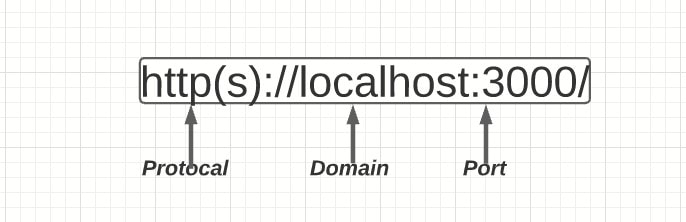
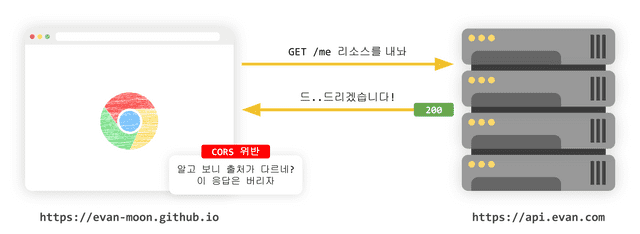
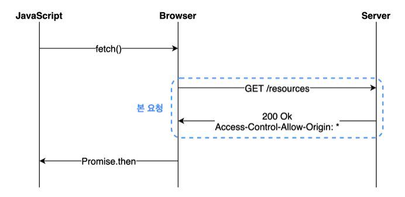
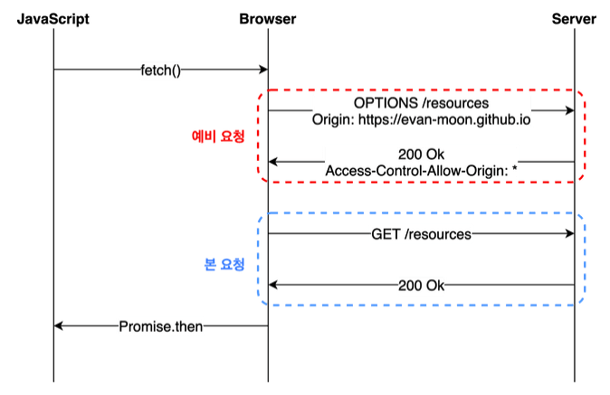

웹 개발을 하다보면 cors 이슈를 한 번쯤은 경험하게 됩니다. CORS이슈를 만날 때마다 여러 블로그글에 나와있는 해결방법을 따라하기 급급했는데 이번 기회에 CORS가 무엇인지 개발과정에서 어떻게 다뤄야할지 공부해봤습니다.

CORS에 관한 자료는 [CORS는 왜 이렇게 우리를 힘들게 하는걸까?](https://evan-moon.github.io/2020/05/21/about-cors/) 해당 글의 도움을 많이 받았습니다.

# 요약

CORS는 다른 출처임에도 브라우저상에서 서로 상호작용이 가능하도록 하는 정책입니다. 배포된 환경에서 (정석적으로) 해당 이슈를 해결하기 위해서는 BE서버에서 HTTP 응답 헤더의 Access-Control-Allow-Origin 속성에 FE 서버(브라우저에서 호스팅되는 서버)의 URL을 추가해주면 됩니다.

요청에 인증 정보(쿠키, 권한 부여 헤더 또는 TLS 클라이언트 인증서 등등)가 담겨있는 상태에서 다른 출처의 리소스를 요청하고 싶다면 아래 3가지 설정을 해야합니다.

1. 요청 헤더에 `withCredentials: true`를 설정하기
2. `Access-Control-Allow-Origin`에 와일드카드(`*`)를 사용할 수 없고, `명시적인 URL`을 사용하기
3. 서버 측 응답헤더에 `Access-Control-Allow-Credentials: true` 설정하기

개발환경에서 BE와 협의 없이 간단하게 해결하기 위해서는 local환경에서 `proxy 서버`를 사용하면 됩니다. (BE 서버 http 응답헤더에 Access-Control-Allow-Origin속성에 와일드 카드나 localhost를 직접 사용하는 건 지양해야합니다.) proxy서버를 사용하면 proxy서버가 BE서버의 origin과 동일한 origin에서 상호작용함으로써 CORS정책 관련 이슈를 우회할 수 있습니다. `CORS는 브라우저의 정책`이기 때문입니다!

저는 주로 react를 사용해서 웹 프론트 개발을 하고 있습니다. 개발환경에서 proxy를 간단하게 해결할 수 있는 방법으로는 cra의 package.json 설정, webpack의 dev server 그리고 http-proxy-middleware가 있습니다.

```jsx
// 프록시 쓰지 않았을때
// localhost:8080(클라이언트 측) --X (CORS)--> domain.com (서버 측)

// 프록시를 설정 후
// localhost:8080(클라이언트 측) < -- O -- > 프록시가 설정된 local server < --- > domain.com (서버 측)
```

## 1. SOP (Same Origin Policy)

SOP는 다른 출처의 리소스를 사용하는 것에 제한하는 보안 방식입니다. `origin(출처)`은 url의 구성요소 중 `protocol, domain, port`로 이뤄져있습니다.



브라우저는 protocal, domain, port 중 어느 하나라도 다르면 다른 origin이라고 판단합니다.

> `http://localhost 와 동일한 origin은 무엇일까? (80은 생략되어 있다.)`

- ✅ http://localhost:80
- ✅ http://locahost/api/cors
- ❌ https://localhost:80
- ❌ http://127.0.0.1 \=> localhost가 맞긴하지만 브라우저입장에서 string value로 비교해서 다르게 판단함

## 2. CORS (Cross-Origin Resource Sharing)

> `추가 http 헤더`를 사용하여, 한 origin에서 실행 중인 웹 애플리케이션이 `다른 origin`의 선택한 자원에 접근할 수 있는 권한을 부여하도록 `브라우저에 알려주는 체제`

**필요한 이유**

클라이언트 웹 애플리이케이션은 보안에 취약합니다. 브라우저 도구만 열어도 dom이 어떻게 작성되었는지, 어떤 서버와 통신하는지, 리소스 출처 등을 확인할 수 있습니다. 예를 들어, cors가 없다면 다른 origin에서 부적절하게 보내는 요청에 대해 필터링 없이 응답을 보내게 될 수 있습니다.

### 브라우저의 역할

이렇게 출저를 비교하는 로직은 서버가 아닌 브라우저에서 구현되어있습니다. 이점이 바로 첫 프로젝트할 때 저희를 괴롭게 한 원인이었습니다. 분명 브라우저에는 오류가 표시되지만 서버에는 정삭적으로 응답했다는 기록만 남겨져 있었습니다.

> 만약 우리가 CORS 정책을 위반하는 리소스 요청을 하더라도 해당 서버가 같은 출처에서 보낸 요청만 받겠다는 로직을 가지고 있는 경우가 아니라면 서버는 정상적으로 응답을 하고, 이후 브라우저가 이 응답을 분석해서 CORS 정책 위반이라고 판단되면 그 응답을 사용하지 않고 그냥 버리는 순서인 것이다.
> 출처: [CORS는 왜 이렇게 우리를 힘들게 하는걸까?](https://evan-moon.github.io/2020/05/21/about-cors/)



사진 출처: [CORS는 왜 이렇게 우리를 힘들게 하는걸까?](https://evan-moon.github.io/2020/05/21/about-cors/)

즉, `CORS는 브라우저의 구현 스펙에 포함되는 정책`이기 때문에, `브라우저를 통하지 않고 서버 간 통신을 할 때는 이 정책이 적용되지 않습니다.` (뒤에 나올 proxy 사용법에 중요한 단서가 됩니다.)

### 2-1. CORS 접근제어 시나리오

- 단순 요청(simple request)
- 프리플라이트 요청(preflight request)
- 인증정보 포함 요청(credentialed request)

#### 단순 요청(simple request)

예비 요청을 보내지 않고 바로 서버에게 본 요청을 보낸 후, 서버가 이에 대한 응답의 헤더에 `Access-Control-Allow-Origin`과 같은 값을 보내주면 그때 브라우저가 CORS 정책 위반 여부를 검사하는 방식입니다.

`단순 요청은 특정 조건을 만족하는 경우에만 예비 요청을 생략한 요청한 뒤 사용가능합니다.`

**특정 조건**

- 요청 메소드 종류 : GET, HEAD, POST 중 하나
- Accept, Accept-Language, Content-Language, Content-Type, DPR, Downlink, Save-Data, Viewport-Width, Width를 제외한 헤더를 사용하면 안 됨.
- Content-Type을 사용할 경우 application/x-www-form-urlencoded, multipart/form-data, text/plain만 허용 (application/json이 안됨)



사진 출처: [CORS는 왜 이렇게 우리를 힘들게 하는걸까?](https://evan-moon.github.io/2020/05/21/about-cors/)

#### 예비 요청(preflight request)

예비 요청에서는 `예비 요청(preflight)`과 `본 요청`을 나누어 서버로 전송합니다. 예비 요청에는 http 메서드중 `OPTIONS`메소드가 사용됩니다. 예비요청은 본 요청을 보내기 전 브라우저 스스로 이 요청이 안전한지 확인하는 역할을 합니다.



사진 출처: [CORS는 왜 이렇게 우리를 힘들게 하는걸까?](https://evan-moon.github.io/2020/05/21/about-cors/)

`Preflight Request`

- origin: 요청 출처
- Access-Control-Request-Method: 실제 요청의 메서드
- Access-Control-Request-Headers: 실제 요청의 추가 헤더

`Preflight Response`

- Access-Control-Allow-Origin: 서버 측 허가 출처
- Access-Control-Allow-Methods: 서버 측 허가 메서드
- Access-Control-Allow-Headers: 서버 측 허가 헤더
- Access-Control-Max-Age: preflight 응답 캐시 시간

#### 인증정보 포함 요청(credentialed request)

기본적으로 브라우저가 제공하는 비동기 리소스 요청 API인 XMLHttpRequest 객체나 fetch API는 별도의 옵션 없이 브라우저의 쿠키 정보나 인증과 관련된 헤더를 함부로 요청에 담지 않습니다.

`withCredentials` 은 쿠키, 권한 부여 헤더 또는 TLS 클라이언트 인증서와 같은 자격 증명을 사용하여 사이트 간 액세스 제어 요청을 만들어야 하는지 여부를 나타내기 위해 사용하는 쿠키를 사용한다면 필요한 설정입니다.

**옵션**

- same-origin: 같은 출처 간 요청에만 인증 정보 담을 수 있습니다.
- include: 모든 요청에 인증 정보 담을 수 있습니다.
- omit: 모든 요청에 인증 정보 담지 않습니다.

만약 클라이언츠에서 `credentials: include`로 변경하고 보낸다면 브라우저에서 Access-Control-Allow-Origin에 와이들카드(\*)를 사용하지 말라는 에러가 발생합니다. 또한, 서버 측 응답헤더에 `Access-Control-Allow-Credentials: true`로 설정되어야 합니다.

정리하자면, 요청에 인증 정보가 담겨있는 상태에서 다른 출처의 리소스를 요청하게 된다면

- `Access-Control-Allow-Origin`에 와일드카드(`*`)를 사용할 수 없고, `명시적인 URL`을 사용해야 합니다.
- 서버 측 응답헤더에 `Access-Control-Allow-Credentials: true` 설정이 되어야 합니다.

## 3. CORS 이슈 발생 및 에러 해결 과정

드디어 CORS가 무엇이고 왜 필요한지 알았습니다! 이제 이슈를 해결해 볼 차례입니다.

제가 프로젝트를 하며 겪은 예시를 통해 해결과정을 설명해보겠습니다. CORS 이슈가 발생했을 때, FE와 BE의 개발환경은 다음과 같았습니다.

- FE: react(cra)를 활용해 로컬 개발(port: 3000)
- BE: spring을 통해 api서버 개발(port: 8081)
- API 요청
  - 요청 방법1: 로컬에서 spring을 실행 이후 요청 : FE(3000) ↔  BE(8081)
  - 요청 방법2: ec2에 배포된 http url로 요청 : FE(3000) ↔  BE(nginx에서 /api 네임 스페이스로 프록싱)

CORS에 대한 이해가 아직 부족하더라도 당황할 필요 없습니다. `CORS 이슈의 에러 메시지에 원인과 해결방법이 친절히 설명되어 있기 때문`입니다. (저도 에러 메세지를 따라 선적용 후학습했습니다.)

> Access to fetch at '[http://our-ec2-host/api/user/login](http://15.164.84.41/api/user/login)' from origin '[http://localhost:3000](http://localhost:3000/)' has been blocked by CORS policy: `Response to preflight request doesn't pass access control check: No 'Access-Control-Allow-Origin' header is present on the requested resource`. If an opaque response serves your needs, set the request's mode to 'no-cors' to fetch the resource with CORS disabled.

하이라이트된 부분을 살펴보면 프리플라이트(preflight) 방식에서 예비 요청이 실패했는데, 그 이유가 `Access-Control-Allow-Origin`값이 없기 때문이라고 알려주고 있습니다. 정석대로 서버에서 Access-Control-Allow-Origin헤더에 알맞은 값을 세팅하여 문제를 해결하면 됩니다.

### 3-1. 와일드 카드 사용 지양하기!

`“*”`와일드 카드를 사용해서 문제를 해결할 수도 있지만 모든 출처에 대한 요청을 수락하는 게 되어버려 보안적인 문제가 발생할 수 있습니다. 당장에 문제는 쉽게 해결할 수 있지만 보안적으로 cors가 해결하는 문제를 해결하지 못하고 심각한 보안 이슈가 발생할 수 있습니다.

```jsx
// BE
app.use((req, res, next) => {
  res.header('Access-Control-Allow-Origin', '*') // 모든 도메인
  res.header('Access-Control-Allow-Origin', '<https://example.com>') // 특정 도메인
})
```

따라서, `Access-Control-Allow-Origin`의 값으로 `프론트의 출처`를 세팅하여야 합니다. 그렇다고 `localhost:3000`같은 범용적인 출처를 적어준다면 앞서 언급한 `*` 와일드 카드와 같은 문제가 발생합니다.

### 3-2. 인증된 요청을 사용하기

`*`와일드카드를 사용하면 다음과 같은 `withCredentials`관련 에러가 발생할 수 있습니다. 2번 CORS 중 인증정보 포함 요청(credentialed request) 챕터를 기억하시나요? 2가지 설정을 하면 됩니다.

> `The value of the ‘Access-Control-Allow-Origin’ header in the response must not be the wildcard ‘*’ when the request’s credentials mode is ‘include’.` The credentials mode of requests initiated by the XMLHttpRequest is controlled by the withCredentials attribute.

위의 문제를 해결하기 위해선 다음과 같은 설정이 필요합니다.

1. 요청 헤더에 `withCredentials: true`를 설정했다면,
2. `Access-Control-Allow-Origin`에 와일드카드(`*`)를 사용할 수 없고, `명시적인 URL`을 사용해야 합니다.
3. 서버 측 응답헤더에 `Access-Control-Allow-Credentials: true` 설정이 되어야 합니다.

### 3-3. Access-Control-Allow-Origin에 어떤 도메인을 넣을껀데?

배포 환경이 아닌 개발과정에서 문제는 아직 해결되지 않았습니다. 개발서버가 따로 있지 않고 하나의 ec2로 작업하고 있는 상황에서 `Access-Control-Allow-Origin의 값을 [localhost:3000](http://localhost:3000)과 같은 범용적인 출처로 설정하면 와일드카드 쓰는 것과 다를게 없다고 생각`했습니다. Access-Control-Allow-Origin에는 배포할 프론트 서버url만 넣고 개발환경에서는 알아서 우회할 수 있는 방법이 없을까 고민했습니다.

**spring을 따로 로컬로 돌려서 api가 잘 동작하나 확인해도 되지만 docker를 사용하지 않는 상황에서 환경변수 및 db설정을 하기 번거롭다고 생각**했습니다. 또한, 서비스는 배포환경에서 돌아가니까 쿠키 및 cors관련 문제를 해결하기위해 최종적으로는 배포된 api에서 확인해야한다고 생각했습니다.

## 4. 최종 설정: proxy 사용

> localhost까지 Access-Control-Allow-Origin에 포함시킬 필요는 없으니까 proxy를 통해 우회해보자!

프록싱을 통해 cors정책을 우회할 수 있는 방법을 찾았습니다!

로컬 환경에서 **`/api`**로 시작하는 URL로 보내는 요청에 대해 브라우저는 **`localhost:3000/api`**
로 요청을 보낸 것으로 알고 있습니다. /api로 시작하는 요청을 proxy를 활용해 `http://내 ec2 host`으로 요청을 프록싱해줘서 cors정책을 지킨 것 브라우저를 속일 수 있었습니다.

### 4.1 proxy로 cors를 속일 수 있는 원리

`CORS 정책은 서버가 아닌 브라우저에 의해 실행`됩니다.

Proxy 서버를 사용하여 브라우저가 원하는 동작 방식을 알려주는 몇 개의 HTTP 헤더를 설정합니다. Proxy 서버는 CORS와 관련된 헤더를 다른 헤더와 마찬가지로 추가, 편집 또는 제거할 수 있습니다.

**요청 흐름**

> 브라우저에서 BE 서버로 요청하는 모든게 proxy 서버를 통해서 나가고, BE에서 넘겨주는 응답도 proxy 서버를 통해서 브라우저로 들어온다.

1. 브라우저에서 BE로 API를 요청
2. 설정한 값에 의해 proxy 서버로 API 요청이 간다.
3. proxy서버에서 설정한 특정 동작 이후 BE로 API요청을 보낸다.
4. BE에서는 요청을 처리하고 응답 헤더에 Access-Control-xxx 정보가 포함된 응답을 proxy 서버로 보낸다.
5. proxy 서버는 전달 받은 응답의 헤더 중 Access-Control-xxx 관련 정보를 수정한다.
6. proxy 서버가 수정된 응답을 브라우저로 보낸다.
7. 브라우저에서 응답 헤더를 살펴보고 CORS 설정이 잘 되어있다고 판단하고 정상 처리한다.

### 4.3 다양한 proxy 설정 방법

```jsx
// .env.development : 개발환경에서는 **localhost:3000/api로 인식하게 하기**
REACT_APP_SERVER_API=/
// .env.production : 배포 이후엔 서버에서 Access-Control-Allow-Origin에 배포된 웹 서버 Url을 설정해서 proxy할 필요 없을 듯
REACT_APP_SERVER_API=http://내 ec2 url/

// src/constant/api.js
export const API_PREFIX = '/api';
export const ROOT_API_URL = process.env.REACT_APP_SERVER_API + API_PREFIX;
```

[1. webpack-dev-server](https://joshua1988.github.io/webpack-guide/devtools/webpack-dev-server.html#프록시-proxy-설정)

```jsx
module.exports = {
  devServer: {
    proxy: {
      '/api': {
        target: 'http://내 ec2 url',
        changeOrigin: true,
      },
    },
  },
}
```

[2. cra → package.json proxy설정](https://create-react-app.dev/docs/proxying-api-requests-in-development)

```jsx
{
// 생략
"proxy": "http://내 ec2 url"
}
```

[3. http-proxy-midddleware](https://create-react-app.dev/docs/proxying-api-requests-in-development/#configuring-the-proxy-manually)

위의 기본 프록시 옵션이 충분히 유연하지 않은 경우 Express 앱 인스턴스에 직접 액세스하고 고유한 프록시 미들웨어를 연결할 수 있습니다. 해당 모듈을 사용하면 소켓(ws)연결과 같은 다양한 설정이 가능하다.

```jsx
// src/setupProxy.js
const proxy = require('http-proxy-middleware')

module.exports = function (app) {
  app.use(
    proxy('/api', {
      target: 'http://내 ec2 url',
      changeOrigin: true,
    }),
  )
}
```

## 5. proxy서버가 정확히 뭘까? 안전할까?

이번 기회를 통해 cors가 무엇인지 왜 필요한지 이론적인 내용을 학습했고, 정석적인 해결방법과 개발 과정에서 편의를 위한 해결방법에 대해 알아볼 수 있었습니다.

하지만 아직 프록시 서버에 대한 여러 의문이 남아 있습니다. proxy서버를 사용하면 Access-Control-Allow-Origin에 범용적인 출처를 적는 것처럼 CORS 정책이 의미 없어지는게 아닐까? 이런식으로 프록시를 사용하는게 url을 필터링해주는 포워드 프록시의 기능이 맞을까? proxy 서버는 어떻게 구현되어 있길래 요청을 가로채서 header 속성을 바꾸는 걸까?

아쉽지만 직접 구현해보면 이해할 수 있지 않을까하는 마음가짐을 가진 채로 마무리하려고 합니다. 기회가 되면 proxy에 깊게 공부해보고 해당 기능을 구현해볼 생각입니다.

## 🔍 참고자료

- [CORS는 왜 이렇게 우리를 힘들게 하는걸까?](https://evan-moon.github.io/2020/05/21/about-cors/)
- [[Web] CORS 동작 방식과 해결 방법](https://ingg.dev/cors/)
- [http/cors - mdn](https://developer.mozilla.org/ko/docs/Web/HTTP/CORS)
- [https://security.stackexchange.com/questions/191737/how-do-cors-proxy-websites-work](https://security.stackexchange.com/questions/191737/how-do-cors-proxy-websites-work)
- [https://httptoolkit.com/blog/cors-proxies/](https://httptoolkit.com/blog/cors-proxies/)
- [https://webpack.js.org/configuration/dev-server/#devserverproxy](https://webpack.js.org/configuration/dev-server/#devserverproxy)
- [https://www.upguard.com/blog/proxy-server](https://www.upguard.com/blog/proxy-server)

실습

- [https://httptoolkit.com/blog/cors-proxies/](https://httptoolkit.com/blog/cors-proxies/)
- [https://medium.com/nodejsmadeeasy/a-simple-cors-proxy-for-javascript-applications-9b36a8d39c51](https://medium.com/nodejsmadeeasy/a-simple-cors-proxy-for-javascript-applications-9b36a8d39c51)
